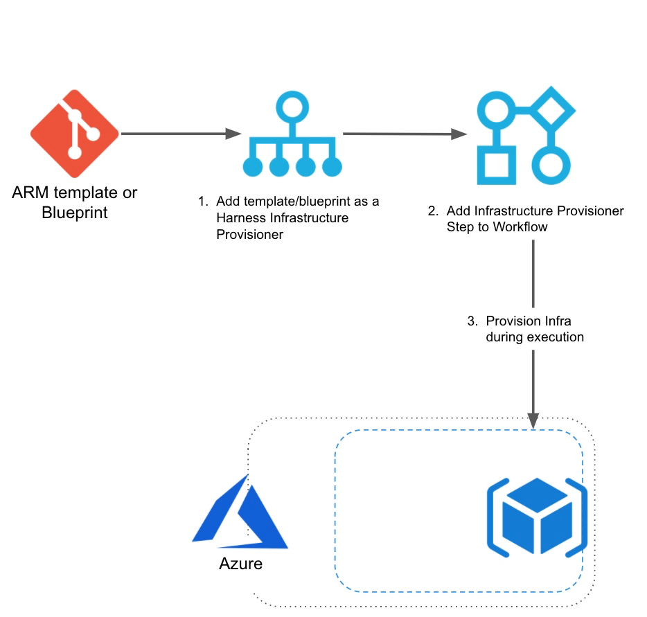
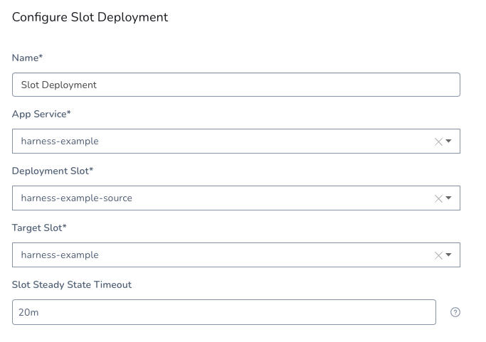
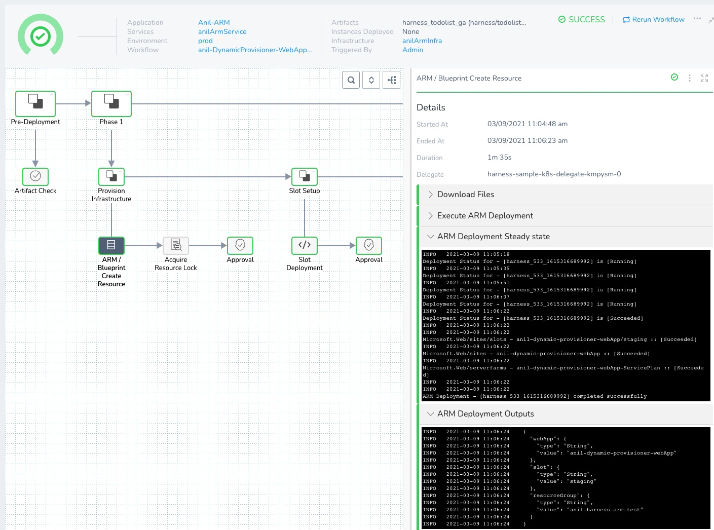

You can provision Azure resources using ARM templates in your Harness Workflows. Harness can provision the resources by themselves or as part of a Workflow performing other deployment steps.

You can also use Azure ARM templates to provision the target infrastructure for some Azure deployments. Harness provisions the infrastructure and then deploys to it in the same Workflow. For steps on this process, see [Provision and Deploy to ARM Provisioned Infrastructure](target-azure-arm-or-blueprint-provisioned-infrastructure.md).

Currently, on [Azure Web App deployments](../azure-webapp-category/azure-web-app-deployments-overview.md) are supported for target infrastructure provisioning.


### Before You Begin

* [Set Up Your Harness Account for Azure ARM](set-up-your-harness-account-for-azure-arm.md)
* [Add Azure ARM Templates to Harness](add-azure-arm-templates.md)
* For a conceptual overview of provisioning with ARM and Blueprints, see [Azure ARM and Blueprint Provisioning with Harness](../../concepts-cd/deployment-types/azure-arm-and-blueprint-provision-with-harness.md).

### Visual Summary

Here's a short video showing how to provision Azure infrastructure using ARM and Harness:

<!-- Video:
https://harness-1.wistia.com/medias/rpv5vwzpxz-->
<docvideo src="https://www.youtube.com/embed/_thro1sA6ek?feature=oembed" />


You can use Azure ARM templates in Harness to provision any resources.

1. **ARM Infrastructure Provisioner**: add your Azure ARM template as a Harness Infrastructure Provisioner.
2. **Workflow Provisioner Step**: there are a few ways to use Workflows to provision:
	1. Create a Canary Workflow or Multi-Service Workflow and add an **ARM/Blueprint Create Resource** step in its **Pre-deployment Steps** to provision the resources you need. You can use the Workflow to deploy anything else, or just omit any further phases and steps.
	2. Create a Canary or Blue/Green Workflow that deploys a Harness Service of the Azure Web App type. Add an **ARM/Blueprint Create Resource** step to its **Provision Infrastructure** section.
3. **Deploy:** the Workflow will provision the resource according to your ARM template.

When you run the Workflow, it can provision the resources without deploying anything else.



### Limitations

* See [Azure Resource Management (ARM) How-tos](azure-arm-and-blueprint-how-tos.md).

### Step 1: Add the Infrastructure Provisioner

A Harness Infrastructure Provisioner connects Harness to the Git repo where your ARM template is located.

To set up a Harness Infrastructure Provisioner for an ARM template, follow the steps in [Add Azure ARM Templates to Harness](add-azure-arm-templates.md).

### Step 2: Add ARM/Blueprint Create Resource Step to Workflow

Canary, Multi-Service, and Blue/Green Workflow types contain a pre-deployment section where you can provision the infrastructure using your Harness Infrastructure Provisioner.

Let's look at a Canary Workflow.

In a Canary Workflow, in **Pre-deployment Steps**, click **Add Step**.

Click **ARM/Blueprint Create Resource** and then click **Next**.

In **Overview**, in **Provisioner**, select the Infrastructure Provisioner for your ARM template.

In **Azure Cloud Provider**, enter the Cloud Provider for Harness to use when connecting to Azure and provisioning with the template.

The Azure service account used with the Cloud Provider must have the Azure permissions needed to provision the resources in your template. See **Azure Resource Management (ARM)** in [Add Microsoft Azure Cloud Provider](https://docs.harness.io/article/4n3595l6in-add-microsoft-azure-cloud-provider).In **Subscription**, select the Azure subscription for the provisioned resources.

In **Resource Group**, select the resource group for the provisioned resources.

In **Mode**, select **Incremental** or **Complete**. This is the same as entering the `--mode` parameter in the `az deployment group create`.

Incremental mode is supported for all Scope types (Subscription, Resource group, Management group, Tenant) and Complete mode is supported for Resource group only.For more information, see [Azure Resource Manager deployment modes](https://docs.microsoft.com/en-us/azure/azure-resource-manager/templates/deployment-modes) from Azure.

In **Timeout**, enter at least 20m. Provisioning Azure resources can take time.

Click **Next**. Now you can specify template parameters.

### Step 3: Specify Template Parameters

In **Parameters**, you enter or link to your template parameters.

In **Source Type**, select **Inline** or **Remote**.

If you select **Inline**, enter the parameters in **Type/Paste JSON Configuration**.

If you select **Remote**, in **Git Repository**, select the Harness Source Repo Provider that connects to the repo where your parameters file is located.

For more information on the Source Repo Provider, see [Set Up Your Harness Account for Azure ARM](set-up-your-harness-account-for-azure-arm.md).

You can specify the repo branch or commit ID and the path to the parameters JSON file. Always include the filename.

#### Review: Parameters JSON Format

Harness accept ARM template parameters is a specific JSON format.

Typically, a parameters JSON file includes the `$schema` key to specify the location of the JSON schema file, and the `contentVersion` to specify the version of the template:


```
{  
  "$schema": "https://schema.management.azure.com/schemas/2019-04-01/deploymentParameters.json#",  
  "contentVersion": "1.0.0.0",  
  "parameters": {  
    "adminUsername": {  
      "value": "johnsmith"  
    },  
    "adminPassword": {  
      "value": "m2y&oD7k5$eE"  
    },  
    "dnsLabelPrefix": {  
      "value": "genunique"  
    }  
  }  
}
```
When you use parameters text or files with Harness, you must remove the `$schema` and `contentVersion` keys.

Harness provisioning requires you remove these keys due to limitations in the Azure Java SDK and REST APIs. Only the parameter object key:value pairs are allowed.

Using the example above, the parameters would be provided like this in Harness:


```
{  
    "adminUsername": {  
      "value": "johnsmith"  
    },  
    "adminPassword": {  
      "value": "m2y&oD7k5$eE"  
    },  
    "dnsLabelPrefix": {  
      "value": "genunique"  
    }  
}
```
This format must be used whether the parameters are added using a remote file or inline.

Click **Submit**.

The **ARM/Blueprint Create Resource** is added to the Workflow.

You can now add the remaining steps for your deployment.

At runtime, the **ARM/Blueprint Create Resource** step will provision.

### Option: Use Harness Variables in Template and Parameters

You can use Harness Workflow and built-in variables in your ARM template and parameters.

At runtime, Harness will replace the variables with the values you or Harness supplies, and then provision using the template and parameters.

For example, here in an example of an Azure Web App template using Workflow variables:


```
{  
  "$schema": "https://schema.management.azure.com/schemas/2019-04-01/deploymentTemplate.json#",  
  "contentVersion": "1.0.0.0",  
  "parameters": {  
    "count": {  
      "type": "int",  
      "defaultValue": ${workflow.variables.count}  
    },  
...
```
Here is an example of parameters using Workflow variables:


```
{  
  "webAppName": {  
    "value": "${workflow.variables.webAppParam}"  
  },  
  "publicIPAddresses_name": {  
    "value": "my-publicIp"  
  }  
}
```
See [Set Workflow Variables](https://docs.harness.io/article/766iheu1bk-add-workflow-variables-new-template) and [Built-in Variables List](https://docs.harness.io/article/aza65y4af6-built-in-variables-list).

### Option: Use Template Outputs in Workflow Steps

You can use the `${arm.<output_name>}` expression to reference the template outputs relevant to Azure Web App Workflow steps.

For details on Web App deployments, see [Azure Web App Deployments Overview](../azure-webapp-category/azure-web-app-deployments-overview.md).

Let's look at an example of the **Slot Deployment** in a Web App [Canary Workflow deployment](../azure-webapp-category/create-an-azure-web-app-canary-deployment.md).

Normally, you would select or enter the App Service, Deployment, and Target Slots for the Web App deployment.

When provisioning, you enter the `${arm.<output_name>}` expression for each setting, mapping the outputs to the steps settings:

At runtime, Harness will substitute the output values, which in this case are taken from a parameters file, and use them for the **Slot Deployment** step.

### Step 4: Deploy the Workflow

Here is an example of a Blue/Green Azure Web App Workflow deployment that uses the Infrastructure Provisioner in its Infrastructure Definition and **ARM/Blueprint Create Resource** step:

In the **ARM/Blueprint Create Resource** step's **Execute ARM Deployment** section, you can see the ARM deployment:


```
Starting template validation  
Saving existing template for resource group - [anil-harness-arm-test]   
Starting ARM Deployment at Resource Group scope ...   
Resource Group - [anil-harness-arm-test]  
Mode - [INCREMENTAL]  
Deployment Name - [harness_533_1615316689992]  
ARM Deployment request send successfully
```
In the **ARM Deployment Steady state** section, you can see the deployment reach steady state:


```
Deployment Status for - [harness_533_1615316689992] is [Running]  
Deployment Status for - [harness_533_1615316689992] is [Running]  
Deployment Status for - [harness_533_1615316689992] is [Running]  
Deployment Status for - [harness_533_1615316689992] is [Running]  
Deployment Status for - [harness_533_1615316689992] is [Succeeded]  
  
Microsoft.Web/sites/slots - anil-dynamic-provisioner-webApp/staging :: [Succeeded]  
Microsoft.Web/sites - anil-dynamic-provisioner-webApp :: [Succeeded]  
Microsoft.Web/serverfarms - anil-dynamic-provisioner-webApp-ServicePlan :: [Succeeded]  
  
ARM Deployment - [harness_533_1615316689992] completed successfully
```
In the **Slot Deployment** step, you will see that the values provided for the template outputs mapped to that step are used.

Now you have provisioned the Web App target infrastructure and deployed to it using a single Workflow.

For information on rollback, see [Azure ARM Rollbacks](azure-arm-rollbacks.md).

### Configure As Code

To see how to configure the settings in this topic using YAML, configure the settings in the UI first, and then click the **YAML** editor button.

