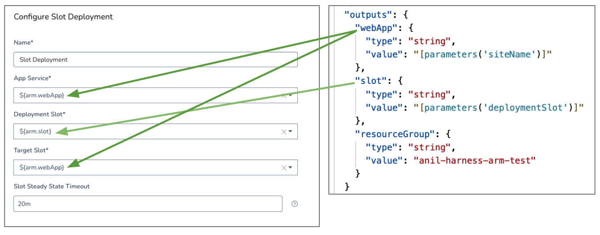

When you use an ARM template in a Harness Workflow to provision Azure resources, you can use the template outputs in some Workflow step settings, or simply echo their values.

This topic describes how to reference template outputs, how they are used in Azure Web App Workflow steps, and how to echo their values.

In this topic:

* [Before You Begin](use-azure-arm-and-blueprint-parameters-in-workflow-steps.md#before-you-begin)
* [Limitations](use-azure-arm-and-blueprint-parameters-in-workflow-steps.md#limitations)
* [Step 1: Use an ARM Template in a Workflow](use-azure-arm-and-blueprint-parameters-in-workflow-steps.md#step-1-use-an-arm-template-in-a-workflow)
* [Review: Referencing ARM Template Outputs](use-azure-arm-and-blueprint-parameters-in-workflow-steps.md#review-referencing-arm-template-outputs)
* [Option 1: Use Outputs in the Slot Setup Step](use-azure-arm-and-blueprint-parameters-in-workflow-steps.md#option-1-use-outputs-in-the-slot-setup-step)
* [Option 2: Echo Template Outputs](use-azure-arm-and-blueprint-parameters-in-workflow-steps.md#option-2-echo-template-outputs)
* [Configure As Code](use-azure-arm-and-blueprint-parameters-in-workflow-steps.md#configure-as-code)

### Before You Begin

* [Set Up Your Harness Account for Azure ARM](set-up-your-harness-account-for-azure-arm.md)
* [Add Azure ARM Templates to Harness](add-azure-arm-templates.md)
* [Provision and Deploy to ARM Provisioned Infrastructure](target-azure-arm-or-blueprint-provisioned-infrastructure.md)
* [Provision Resources using a Harness ARM Infrastructure Provisioner](provision-using-the-arm-blueprint-create-resource-step.md)
* For a conceptual overview of provisioning with ARM and Blueprints, see [Azure ARM and Blueprint Provisioning with Harness](../../concepts-cd/deployment-types/azure-arm-and-blueprint-provision-with-harness.md).

### Limitations

* See [Azure Resource Management (ARM) How-tos](azure-arm-and-blueprint-how-tos.md).

### Step 1: Use an ARM Template in a Workflow

Once you have added an ARM template as a Harness Infrastructure Provisioner, you can use the Infrastructure Provisioner in a Workflow in the following ways:

* **Target the Azure infrastructure:** use the Infrastructure Provisioner in a Harness Infrastructure Definition. Next, you add this Infrastructure Definition to a Workflow to define the ARM template's resources as the target infrastructure for the deployment.  
See [Target an Azure ARM Provisioned Infrastructure](target-azure-arm-or-blueprint-provisioned-infrastructure.md).
* **Provision the Azure infrastructure:** use the Infrastructure Provisioner in a Harness Workflow to provision the Azure resources. This will run your ARM template and create its Azure resources. These resources could be the target infrastructure for a deployment from the Infrastructure Definition or simply other Azure resources.  
See [Provision using a Harness ARM Infrastructure Provisioner](provision-using-the-arm-blueprint-create-resource-step.md).

### Review: Referencing ARM Template Outputs

You reference ARM template outputs in Workflow steps using the format `${arm.<output_name>}`. First, you need to use the Infrastructure Provisioner that links to your ARM template.

You use the Harness ARM Infrastructure Provisioner in a Workflow in the **ARM/Blueprint Create Resource** step.

Once you have set up the the **ARM/Blueprint Create Resource** step, you can reference the template's outputs.

Ensure that the ARM template you added in the Infrastructure Provisioner you selected in **Provisioner** includes outputs.

For example, here are the outputs from an ARM template to provision Azure Web Apps:


```
...  
"outputs": {  
    "webApp": {  
      "type": "string",  
      "value": "[parameters('siteName')]"  
    },  
    "slot": {  
      "type": "string",  
      "value": "[parameters('deploymentSlot')]"  
    },  
    "resourceGroup": {  
      "type": "string",  
      "value": "harness-arm-test"  
    }  
  }  
...
```
You can see the `resourceGroup` output. You can reference that output, or any output, using the expression `${arm.<output_name>}`.

For example, to reference `resourceGroup` you can use `${arm.resourceGroup}`.

At runtime, Harness will pull the values for the settings from your ARM template.

### Option 1: Use Outputs in the Slot Setup Step

Using outputs in the Slot Setup step as part of an Azure Web App deployment is described in detail in [Provision and Deploy to ARM Provisioned Infrastructure](target-azure-arm-or-blueprint-provisioned-infrastructure.md).If the Azure Web App Workflow uses an Infrastructure Definition that uses an Infrastructure Provisioner (such as ARM Infrastructure Provisioner) then the **Slot Setup** step must use template outputs in its settings.

The **Slot Setup** step uses the Infrastructure Definition settings to pull App Service and slot information from Azure. If the Infrastructure Definition uses an Infrastructure Provisioner, then Harness cannot obtain this information until runtime.

For details on Web App deployments, see [Azure Web App Deployments Overview](../azure-webapp-category/azure-web-app-deployments-overview.md).

Let's look at an example of the **Slot Setup** in a Web App [Blue/Green Workflow deployment](../azure-webapp-category/create-an-azure-web-app-blue-green-deployment.md#step-3-slot-deployment-step).

Normally, you would select or enter the App Service, Deployment, and Target Slots for the Web App deployment.

When provisioning, you enter the `${arm.<output_name>}` expression for each setting, mapping the outputs to the steps settings:

At runtime, Harness will substitute the output values, which in this case are taken from a parameters file, and use them for the **Slot Setup** step.

### Option 2: Echo Template Outputs

You can reference outputs in a Workflow step by simply echoing them.

For example, here are some outputs from a template:


```
"outputs": {  
    "storageAccount": {  
      "type": "string",  
      "value": "anilstoragetestharness"  
    },  
    "ipAddresses": {  
      "type": "array",  
      "copy": {  
        "count": "[parameters('count')]",  
        "input": "[reference(concat('nic-', copyIndex())).ipConfigurations[0].properties.privateIPAddress]"  
      }  
    },  
    "publicIp": {  
      "type": "string",  
      "value": "[parameters('publicIPAddresses_name')]"  
    },  
    "appPlan": {  
      "type": "string",  
      "value": "[variables('appServicePlanName')]"  
    },  
    "webApp": {  
      "type": "string",  
      "value": "[variables('webAppPortalName')]"  
    },  
    "slot": {  
      "type": "string",  
      "value": "[concat(variables('webAppPortalName'), '/testSlot')]"  
    }  
  }
```
Here is a bash script for a Shell Script step that references the outputs:


```
echo "***************** ARM output *****************"  
echo "Storage account:" ${arm.storageAccount}  
echo "Public Ip:" ${arm.publicIp}  
echo "App Service Plan:" ${arm.appPlan}  
echo "Web App Name:" ${arm.webApp}  
echo "Web App Slot:" ${arm.slot}
```
Here is the [Shell Script step](../../model-cd-pipeline/workflows/capture-shell-script-step-output.md) log from the deployment showing the echo of the outputs:


```
Executing command ...  
***************** ARM output *****************  
Storage account: anilstoragetestharness  
Public Ip: anil-publicIp  
App Service Plan: AppServicePlan-anil-paramWebapp-git  
Web App Name: anil-paramWebapp-git-webapp  
Web App Slot: anil-paramWebapp-git-webapp/testSlot  
Command completed with ExitCode (0)
```
### Configure As Code

To see how to configure the settings in this topic using YAML, configure the settings in the UI first, and then click the **YAML** editor button.

