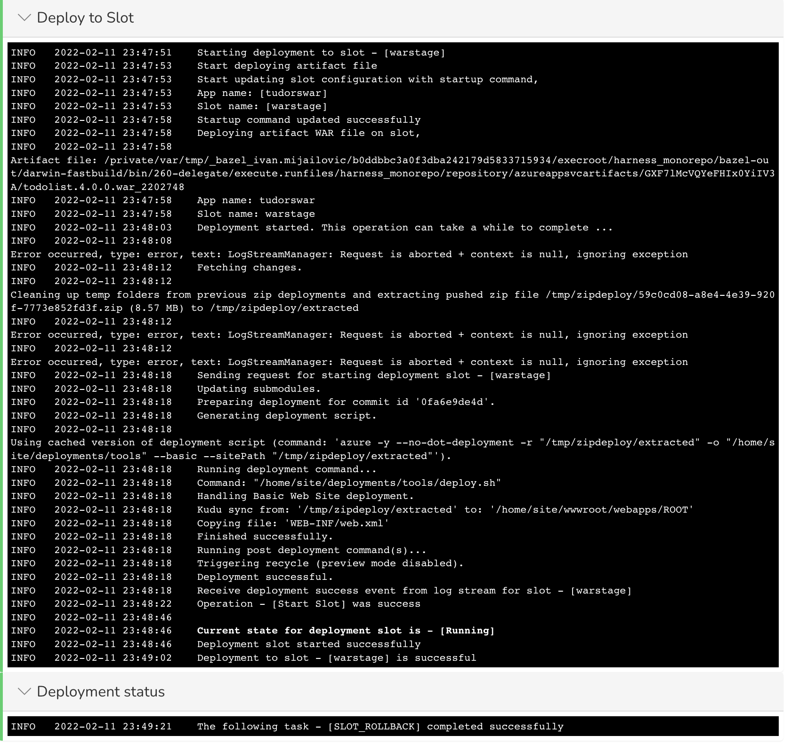

Currently, this feature is behind the Feature Flag `AZURE_WEBAPP`. Contact [Harness Support](https://mail.google.com/mail/?view=cm&fs=1&tf=1&to=support@harness.io) to enable the feature.Harness performs rollback on failed [Azure Web App deployments](azure-web-app-deployments-overview.md).

### Limitations

#### Rollback Limitations for both Azure Container and Non-Containerized Rollbacks

For Non-Containerized artifacts deployments, see [Add Non-Containerized Artifacts for Azure Web App Deployment](add-a-non-containerized-artifacts-for-azure-web-app-deployment.md).* **Harness Post-Deployment Rollback:** to see if Post-Production Rollback is supported for Azure Web App deployments, see [Rollback Production Deployments](../../model-cd-pipeline/workflows/post-deployment-rollback.md).
* Rollback only restores the state of the **stage** slot. If a step that follows the **Swap Slot** step fails, such as a failed Approval or Shell Script step, Harness only rolls back the **stage** slot. The target slot is not changed.

#### Rollback Limitations for Non-Containerized Rollbacks

Rollback for Non-Containerized artifact deployments is not supported for the first two deployments because the necessary artifact details are not available to perform a rollback.

#### Streaming Logs Limitations for both Azure Container and Non-Containerized Deployments

You might face timeout issues as a result of limitations with streaming Web App slot deployment logs. For example, you might see `java.net.SocketTimeoutException: timeout` or some other socket errors as a result of the Azure SDK client.

Harness is working with the Azure team for a resolution (see [issue 27221](https://github.com/Azure/azure-sdk-for-java/issues/27221)). At this time, you can use a Harness [HTTP step](../../model-cd-pipeline/workflows/using-the-http-command.md) to verify that the slot is up and ready.

### Rollback Summary

For [Azure Web App deployments](azure-web-app-deployments-overview.md), Harness saves the previous Docker or non-containerized app details that were running on the slot.

In case of an Azure Web App deployment failure, Harness rollback redeploys the previous instance.

### Slot Rollback

Harness initially deploys to the source (staging) slot and then swaps slots with the target (production) slot.

As the source slot is the slot is where Harness deploys the new Web App version, Harness rolls back the app version in the source slot only.

Harness does not rollback the app version in the target slot.

### Traffic Rollback

Harness returns all traffic to the previous, pre-deployment percentages.

If the pre-deployment traffic was arranged with the source slot at 20% and the target slot at 80%, rollback will return network traffic to these percentages.

### Rollback Example for Non-Containerized Rollbacks

Here's an example of a rollback.

**Update Slot Configuration Settings**:


**Deploy to Slot**:



### Rollback Logs

Here's the log activity from a rollback with the timestamps removed:


```
Sending request for stopping deployment slot - [stage]  
Operation - [Stop Slot] was success  
Request sent successfully  
  
Start updating Container settings for slot - [stage]  
Start cleaning existing container settings  
  
Current state for deployment slot is - [Stopped]  
Deployment slot stopped successfully  
  
Start updating application configurations for slot - [stage]  
Deployment slot configuration updated successfully  
  
Existing container settings deleted successfully  
Start cleaning existing image settings  
  
Existing image settings deleted successfully  
Start updating Container settings:   
[[DOCKER_REGISTRY_SERVER_URL]]  
  
Container settings updated successfully  
Start updating container image and tag:   
[library/nginx:1.19-alpine-perl], web app hosting OS [LINUX]  
  
Image and tag updated successfully for slot [stage]  
Deployment slot container settings updated successfully  
  
Sending request for starting deployment slot - [stage]  
Operation - [Start Slot] was success  
Request sent successfully  
  
Sending request to shift [0.00] traffic to deployment slot: [stage]  
  
Current state for deployment slot is - [Running]  
Deployment slot started successfully  
  
Traffic percentage updated successfully  
  
The following task - [SLOT_ROLLBACK] completed successfully
```
### See Also

* [Resume Pipeline Deployments](../../concepts-cd/deployments-overview/resume-a-pipeline-deployment.md)

