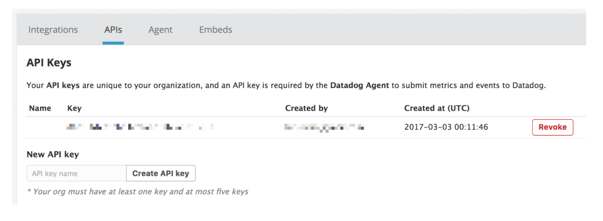
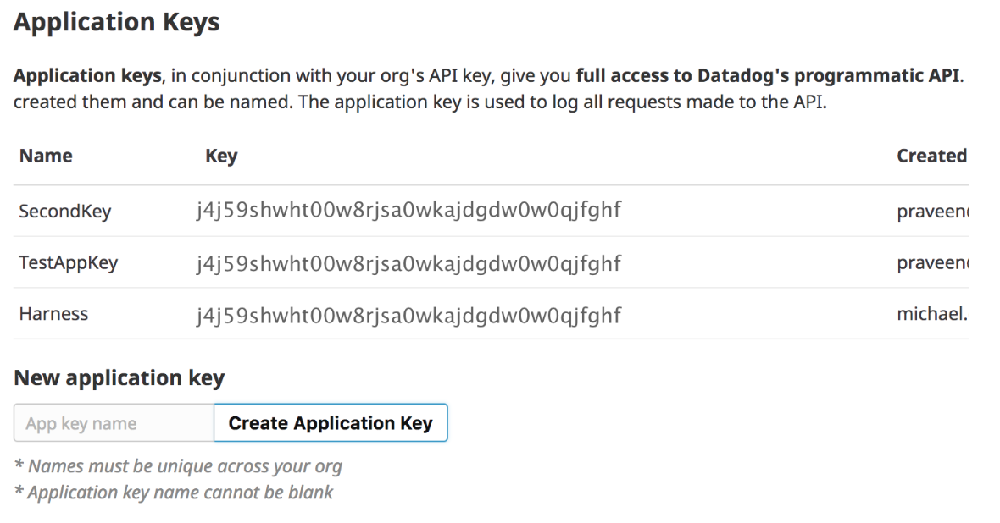
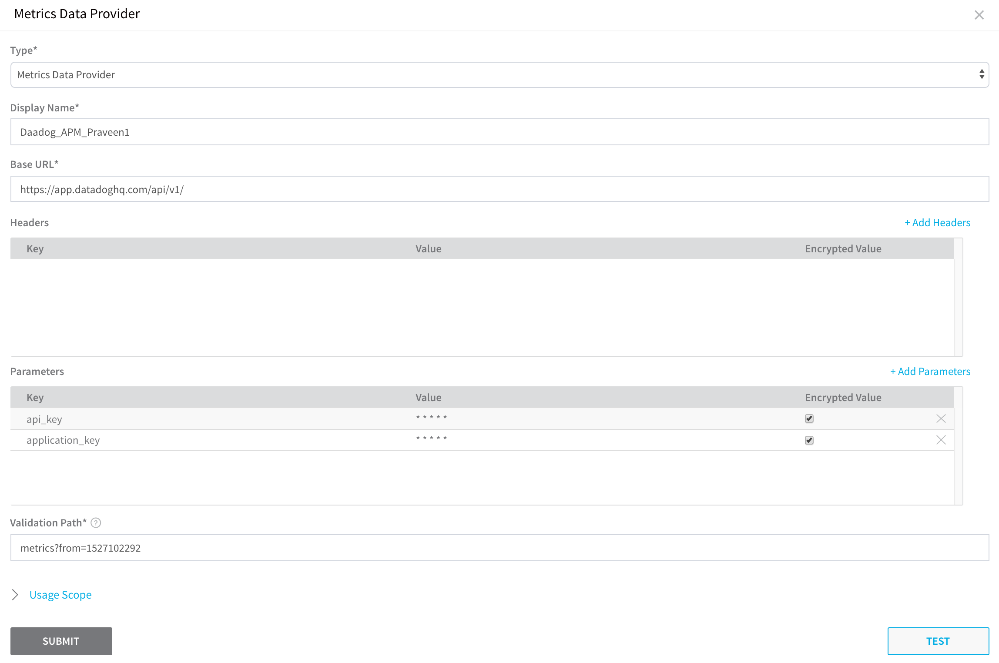

Currently, Datadog-Harness integration is for Kubernetes deployments only. To use Datadog with other deployment types, such as ECS, use the following example of how to use the Custom Metrics Provider with Datadog.

### Before You Begin

* See [Custom Verification Overview](custom-verification-overview.md).

### Step 1: Add Datadog as a Custom Verification Provider

To add a Custom Metrics Provider using Datadog, do the following:

1. In Harness Manager, click **Setup** > **Connectors** > **Verification Providers**.
2. Click **Add Verification Provider**, and click **Custom Verification**. The **Metrics Data Provider** dialog appears.
3. In **Type**, select **Metrics Data Provider**.

### Step 2: Display Name

In **Display Name**, give the Verification Provider a name. You will use this name to select this provider in a Workflow.

### Step 3: Base URL

In **Base URL**, enter `https://app.datadoghq.com/api/v1/`.

### Step 4: Parameters

In **Parameters**, click **Add Parameters**, and add the following parameters.

|  |  |  |
| --- | --- | --- |
| **Key** | **Value** | **Encrypted Value** |
| api\_key | Enter the API key. | Checked |
| application\_key | Enter the application key. | Checked |

If you need help obtaining the API and Application keys, see the following:

#### API Key

To create an API key in Datadog, do the following:

1. In **Datadog**, mouseover **Integrations**, and then click **APIs**.
   
   
   The **APIs** page appears.
   
   
   
2. In **API Keys**, in **New API key**, enter the name for the new API key, such as **Harness**, and then click **Create API key**.
3. Copy the API key and, in **Harness**, paste it into the **Value** field.

#### Application Key

To create an application key in Datadog, do the following:

1. In **Datadog**, mouseover **Integrations**, and then click **APIs**. The **APIs** page appears.

   
   
   
2. In **Application Keys**, in **New application key**, enter a name for the application key, such as **Harness**, and click **Create Application Key**.
3. Copy the API key and, in **Harness**, paste it into the **Value** field.

### Step 5: Validation Path

In **Validation Path**, enter `metrics?from=1527102292`. This is the epoch seconds value used to ensure an HTTP 200 response with the credentials validated.

When you are finished, the dialog will look something like this:

Click **Submit**.

### See Also

* [Verify Deployments with Datadog as a Custom APM](verify-deployments-with-datadog-as-a-custom-apm.md).

