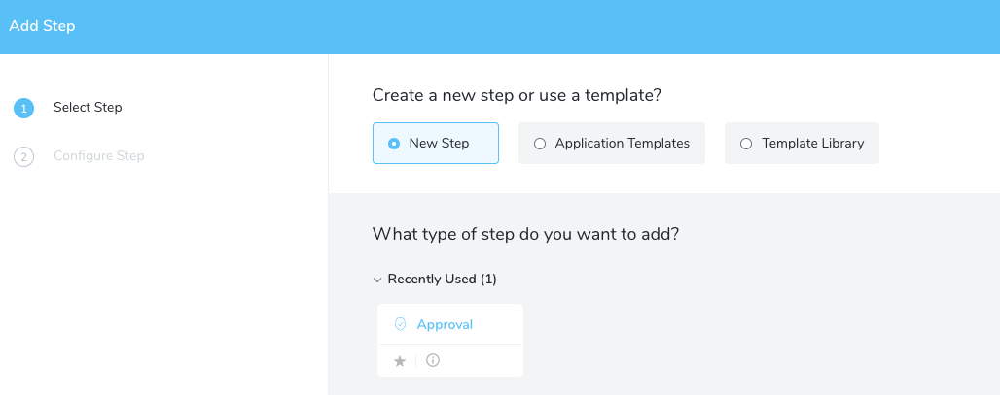
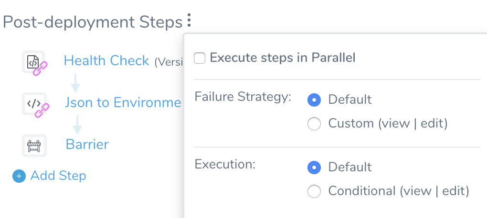

Different Workflow deployment types involve different Workflow steps. Each type of step, such as **Deploy Containers** or **Verify Service**, has specific commands and options available to it.

### Before You Begin

* [Add a Workflow](tags-how-tos.md)
* [Workflows](workflow-configuration.md)
* [Skip Workflow Steps](skip-workflow-steps.md)

### Step: Add Step for Different Workflow Tasks

To add steps, do the following:

1. Under the Workflow step, click **Add Step**. The Add Step options appear:

   
   
2. To use a template, click **Add Step**, and then click **Template Library**. For more information, see [Use Templates](../../concepts-cd/deployment-types/use-templates.md).
3. If a step has multiple commands, you can arrange them. **Mouseover** the command and then click the **down arrow**.
4. You can also control how the multiple commands and steps are executed. Click the vertical ellipsis next to a step with multiple steps. The execution drop-down appears.

   

### Next Steps

* [Add Phases to a Workflow](add-workflow-phase-new-template.md)
* [Verify Workflow](verify-workflow-new-template.md)

