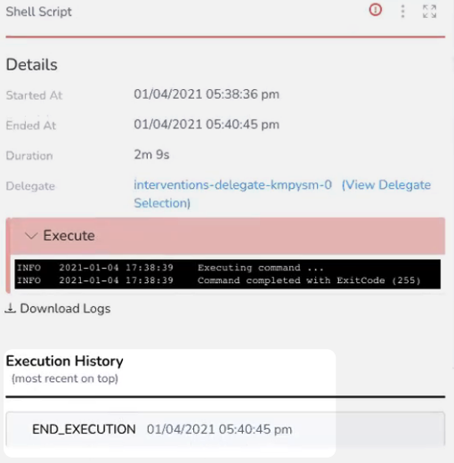
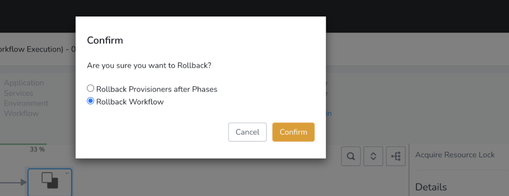
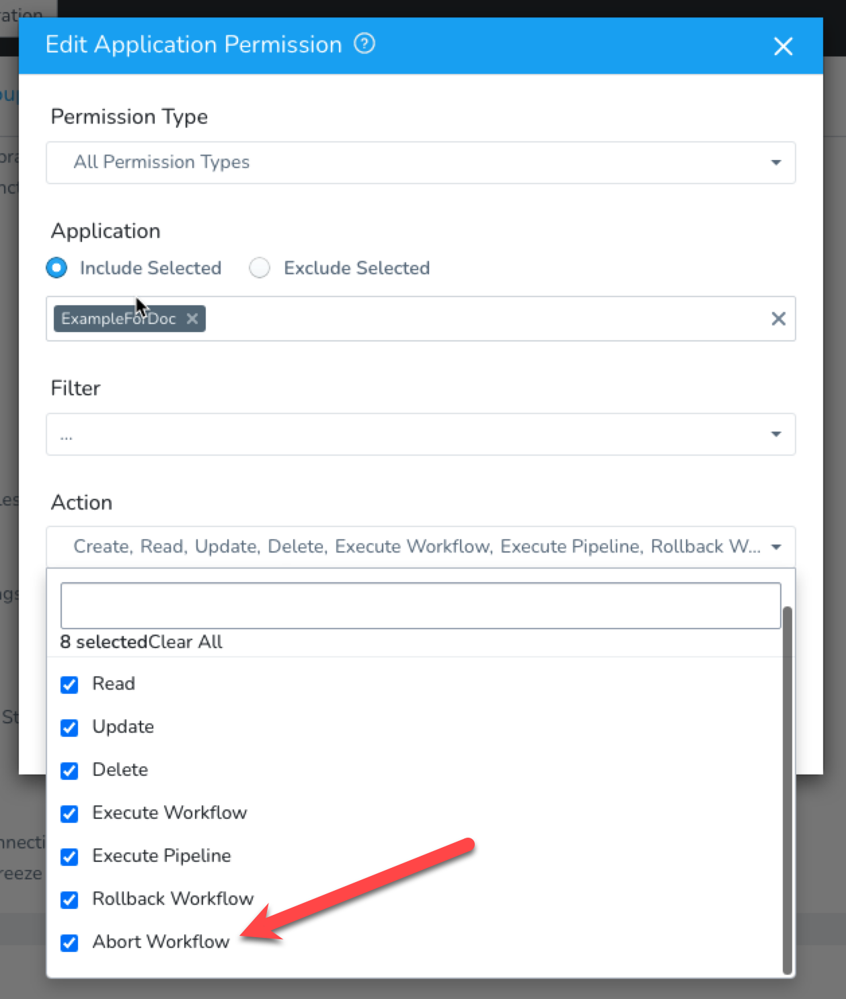
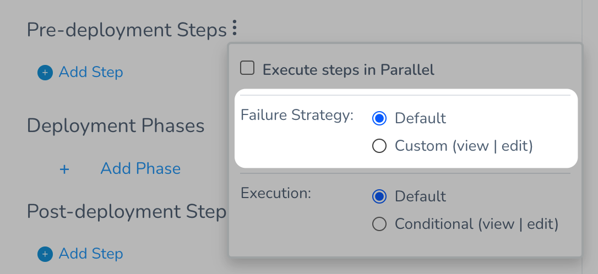
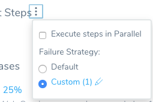
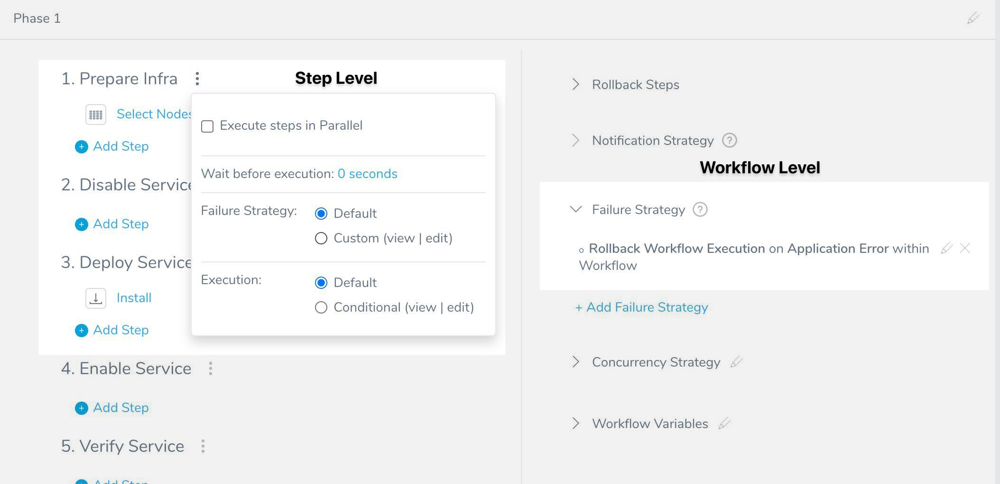

A Failure Strategy defines how your Workflow handles different failure conditions.

There is no Failure Strategy in a [Build Workflow](../../concepts-cd/deployment-types/ci-cd-with-the-build-workflow.md) because there is no rollback in a Build Workflow. A Build Workflow simply runs a build job and collects an artifact.

### Before You Begin

* [Add a Workflow](tags-how-tos.md)
* [Add Phases to a Workflow](add-workflow-phase-new-template.md)
* [Skip Workflow Steps](skip-workflow-steps.md)
* [Review: Multiple Failure Strategies in a Workflow](#review_multiple_failure_strategies_in_a_workflow)

### Review: Workflow and Phase Priority

You can define a Failure Strategy at the Workflow step and Phase level.

**What is a Phase?** Unless you add multiple phases to your Workflow, the Workflow is considered a single Phase. Canary Workflows use multiple phases, and other Workflow types, such as Blue/Green and Rolling, are considered single Phase Workflows.

The Failure Strategy applied to a Workflow step takes precedence over the Failure Strategy applied to the Phase.

The Workflow step Failure Strategy does not propagate to the parent Phase.

### Step: Add Workflow Failure Strategy

To define the failure strategy for the entire Workflow, do the following:

1. In a Workflow, click **Failure Strategy**. The default failure strategy appears.  
  
   The default failure strategy is to fail the Workflow if there is any application error, and to rollback the Workflow execution. You can modify the default strategy or additional strategies.
   
2. Click **Add Failure Strategy**. The Failure Strategy settings appear.

   

The dialog has the following fields:

#### Failure

Select the type of error:

##### Application Error

Harness encountered an application error during deployment.

##### Unsupported Types

The following types are listed but not supported at this time:

* **Connectivity Error:** Harness is unable to connect to the target host/cluster/etc, or a provider, such as a Git repo.
* **Authentication Error:** Harness is unable to authenticate using the credentials you supplied in the Cloud Provider, Artifact Source, Source Repo Provider, and other connectors.
* **Verification Error:** If you have set up verification steps in your Workflow and a deployment event is flagged as an error by the step, Harness will fail the deployment.

#### Scope

Select the scope of the strategy. If you select **Workflow**, the Action is applied to the entire Workflow. If you select **Workflow Phase**, then the Action is applied to the **Workflow Phase** only.

For example, if you selected **Workflow Phase** and then selected the Action **Rollback Phase Execution**, and a failure occurred in the second Phase of the Workflow, then the second Phase of the Workflow would be rolled back but the first Phase of the Workflow would not be rolled back.

#### Action

Select the action for Harness to take in the event of a failure, such as a retry or a rollback:

##### Manual Intervention

Applies to Workflow steps only, but not Approval steps or [Resource Lock](workflow-queuing.md#acquiring-resource-locks).

You will be prompted to approve or reject the deployment on the Deployments page.

##### Timeout (Manual Intervention)

If you select **Manual Intervention** in **Action**, enter a timeout in **Timeout** and an action in **Action after timeout** (such as **Ignore**). Once the timeout is reached, the action is executed.

The default value for **Timeout** is 14 days (**14d**).

The available actions in **Action after timeout** are:

* Ignore
* Mark as Success
* End Execution
* Abort Workflow
* Rollback Workflow
* Rollback Provisioner after Phases

**Abort Workflow** and **Rollback Workflow** are different. When you use Abort Workflow, Harness does not clean up any deployed resources or rollback to a previous release and infrastructure.When a Workflow is paused on manual intervention, you can choose the action by clicking on the Workflow step.

If a manual intervention has occurred, you can see it in the Workflow step details in **Deployments**. Here is an example using **End Execution**:

##### Rollback Workflow Execution

**Abort Workflow** and **Rollback Workflow** are different. When you use Abort Workflow, Harness does not clean up any deployed resources or rollback to a previous release and infrastructure.(Applies to Workflow Phase only)

Harness will initiate rollback.

Failure strategies can be applied at both the Workflow step and Phase level:

You can choose **Rollback Provisioner after Phases** or **Rollback Workflow**.

Currently, this feature is behind the Feature Flag `ROLLBACK_PROVISIONER_AFTER_PHASES`. Contact [Harness Support](mailto:support@harness.io) to enable the feature.

**Rollback Workflow Execution** is not applicable for Workflow steps, presently. It applies to Workflow Phases.

##### Rollback Phase Execution

Harness will initiate rollback of the Phase.

##### Rollback Provisioner After Phases

Currently, this feature is behind a Feature Flag. Contact [Harness Support](mailto:support@harness.io) to enable the feature. Feature Flags can only be removed for Harness Professional and Essentials editions. Once the feature is released to a general audience, it's available for Trial and Community Editions.  
  
See [New features added to Harness](https://changelog.harness.io/?categories=fix,improvement,new) and [Features behind Feature Flags](https://changelog.harness.io/?categories=early-access) (Early Access) for Feature Flag information.This option is for Canary and Multiservice Workflows that use Infrastructure Provisioners in their **Pre-deployment** steps to provision the target infrastructure.

This failure strategy should be used in Workflows that support **Pre-deployment Steps** only (Canary and Multiservice).By default, provisioners are rolled back before deployment phases and all provisioners are rolled back in the same order in which they were deployed.

When the **Rollback Provisioner After Phases** failure strategy is used, rollback will happen as follows:

1. Deployment phases are rolled back before the Infrastructure Provisioners in **Pre-deployment steps**.
2. All Infrastructure Provisioners in the **Pre-deployment Steps** are rolled back in the reverse order in which they were deployed.

##### Ignore

Harness ignores any failure and continues with deployment. The deployment does not fail on this step and the status is Passed.

##### Retry

(Applies to Workflow steps only)

Harness will retry the step where the failure occurred. This is also only applicable to Workflow steps.

##### End Execution

Harness will end the Workflow (fail the state) and roll back any deployed resources. The status of the Workflow will be Failed. Typically, End Execution is used with Manual Intervention.

If a step or Phase needs rollback (meaning, it deployed something), End Execution will not prevent rollback. For example, in a strategy using **End Execution**, a provisioning step (Terraform, CloudFormation, etc) will be rolled back, but an HTTP step will not be rolled back since it doesn't deploy anything.

If you want to prevent rollback, use **Abort Workflow**.

##### Abort Workflow

**Abort Workflow** and **Rollback Workflow** are different. When you use Abort Workflow, Harness does not clean up any deployed resources or rollback to a previous release and infrastructure.Harness will abort the Workflow without rolling back. The status of the Workflow will be Aborted.

If you want a failure to also initiate rollback, use **Rollback Workflow**, **End Execution**, **Rollback Phase Execution**, or **Rollback Provisioner After Phases**.

To abort a Workflow, the Harness User must belong to a User Group with the Abort Workflow Application Permission enabled.

Without this permission enabled, the User will not see an **Abort** option in the running Workflow deployment page.

### Step: Step-level Failure Strategy

To define the failure strategy for the step section of a Workflow, do the following:

1. Next to the step section title, click more options (**⋮**). The step-level settings appear.

   
   
2. In **Failure Strategy**, click **Custom**. The **Failure Strategy** settings appear.

   
   
3. Click **Add Failure Strategy**.
4. Fill out the strategy. The dialog has the following fields:
    * **Failure** - Select the type of error, such as Verification, Application, etc. The step-level Failure Strategy has the same options as the Phase-level Failure Strategy, with the exception of [Timeout Error](#timeout_error).
    * **Action** - Select the action for Harness to take in the event of a failure, such as a retry or a rollback.
    * **Specific Steps** - Select any specific Workflow steps that you want to target for the Failure Strategy.  
      The criteria for the strategy will be applied to those steps only.
    
    :::note    
    If you do not select steps, then the strategy is applied to all steps in that Workflow section.
    :::

    There is no **Scope** setting, like the **Scope** setting in the Workflow-level Failure Strategy, because the scope of this strategy is the step section.

5. Click **Submit**. The failure strategy is added to the step section.

   

#### Timeout Error

Currently, this feature is behind a Feature Flag. Contact [Harness Support](mailto:support@harness.io) to enable the feature. Feature Flags can only be removed for Harness Professional and Essentials editions. Once the feature is released to a general audience, it's available for Trial and Community Editions.The Timeout Error condition in a Workflow step-level Failure Strategy helps you manage ECS step timeouts when you are deploying many containers in a Workflow or Pipeline. Timeout Error helps you manage these timeouts gracefully.

In **Specific Steps**, you can select one or more of the following step types:

* ECS Service Setup
* ECS Run Task
* ECS Daemon Service Setup
* Setup Load Balancer
* Setup Route 53
* ECS Upgrade Containers
* ECS Steady State Check
* Swap Target Groups
* Swap Route 53 DNS
* Rollback ECS Setup
* ECS Rollback Containers
* Rollback Route 53 Weights
* Rollback Swap Target Groups
* HTTP
* Shell Script

### Delegate Error

Currently, this feature is behind the Feature Flag `FAIL_TASKS_IF_DELEGATE_DIES`. Contact [Harness Support](mailto:support@harness.io) to enable the feature.During Workflow execution, if a Delegate goes down, the tasks are marked as failed.

With the **Delegate Error** condition, you can identify such situations faster and retrigger the steps.

A Delegate times out if it fails to send heartbeats within 3 minutes. You can apply a failure strategy in such scenarios and retrigger the tasks.

### Review: Multiple Failure Strategies in a Workflow

When using multiple Failure Strategies in a Workflow, consider the following:

* For failure strategies that do not overlap (different types of failures selected), they will behave as expected.
* Two failures cannot occur at the same time, so whichever error occurs, that Failure Strategy will be used.

#### Conflicts

Conflicts might arise between failure strategies on the same level or different levels. By *level*, we mean the step-level or the Workflow level:

##### Same level

If there is a conflict between multiple failures in strategies on the same level, the first applicable strategy is used, and the remaining strategies are ignored.

For example, consider these two strategies:

1. Abort Workflow on Verification Failure or Authentication Failure.
2. Ignore on Verification Failure or Connectivity Error.

Here's what will happen:

* On a verification failure, the Workflow is aborted.
* On an authentication failure, the Workflow is aborted.
* On a connectivity error, the error is ignored.

##### Different levels

If there is a clash of selected failures in strategies on different levels, the step-level strategy will be used and the Workflow level strategy will be ignored.

