You can integrate testing into Harness Workflows, such as unit, functional, and smoke and sanity tests.

In this topic we will walk you through common test integrations.

### Before You Begin

* **Application used in this topic** — This topic uses a simple Java application that exposes a REST endpoint: the [Hello World Quarkus app](https://quarkus.io/guides/getting-started). It includes unit tests using the [REST Assured](http://rest-assured.io/) Java DSL.
* [Artifact Build and Deploy Pipelines](https://docs.harness.io/category/j1q21aler1-build-deploy) — Review these How-tos to learn about CI/CD integration in Harness.

### Visual Summary

Here is a completed Harness Pipeline execution. The Pipeline incorporate the Jenkins unit tests, third-party functional tests, and HTTP smoke tests. In this topic we will be exploring the different tests used in the Pipeline.


The Pipeline skips approval gates and other stages, such as creating a change ticket and updating Jira. These are added to production Pipelines, typically.

See [Approvals](../approvals/approvals.md), [Jira Integration](jira-integration.md). and [ServiceNow Integration](service-now-integration.md).

### Review: Harness CI Connectors

You can use Harness to run a build or test process via Jenkins, Bamboo, Shell Script, or any CI tool.

First, you need to connect Harness with Jenkins, Bamboo, or other CI tool.

For Jenkins and Bamboo connections, see [Add Artifact Servers](https://docs.harness.io/article/7dghbx1dbl-configuring-artifact-server).

For integrating CI using Shell Scripts, see [Using the Shell Script Command](capture-shell-script-step-output.md).

### Use Case 1: Use an Existing Jenkins Pipeline

Many Harness customers use the Harness Jenkins integration to build and collect artifacts as part of their Pipelines.

Customers also reuse existing Jenkins pipelines to run tests against deployments in different environments, such as QA, UAT, SIT, etc.

Let's look at a Jenkins pipeline execution that uses parameters to skip the build stage and run tests.

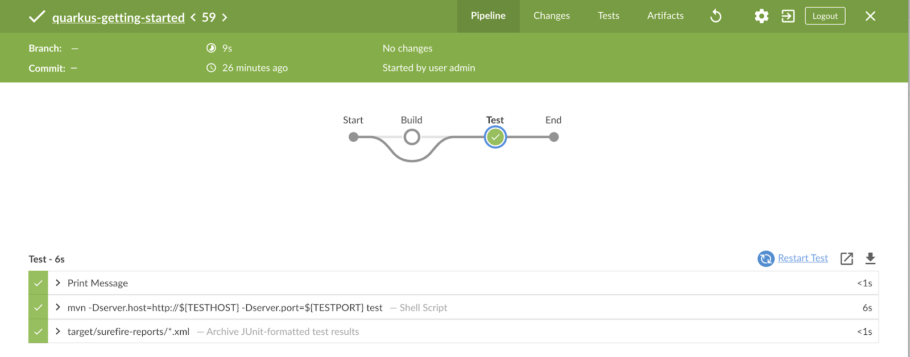

In Harness, we'll execute this Jenkins pipeline as part of a deployment Workflow.

The first step is to add a Jenkins Artifact Server in Harness, as described in [Add Artifact Servers](https://docs.harness.io/article/7dghbx1dbl-configuring-artifact-server).

In this example, we are running Jenkins locally:

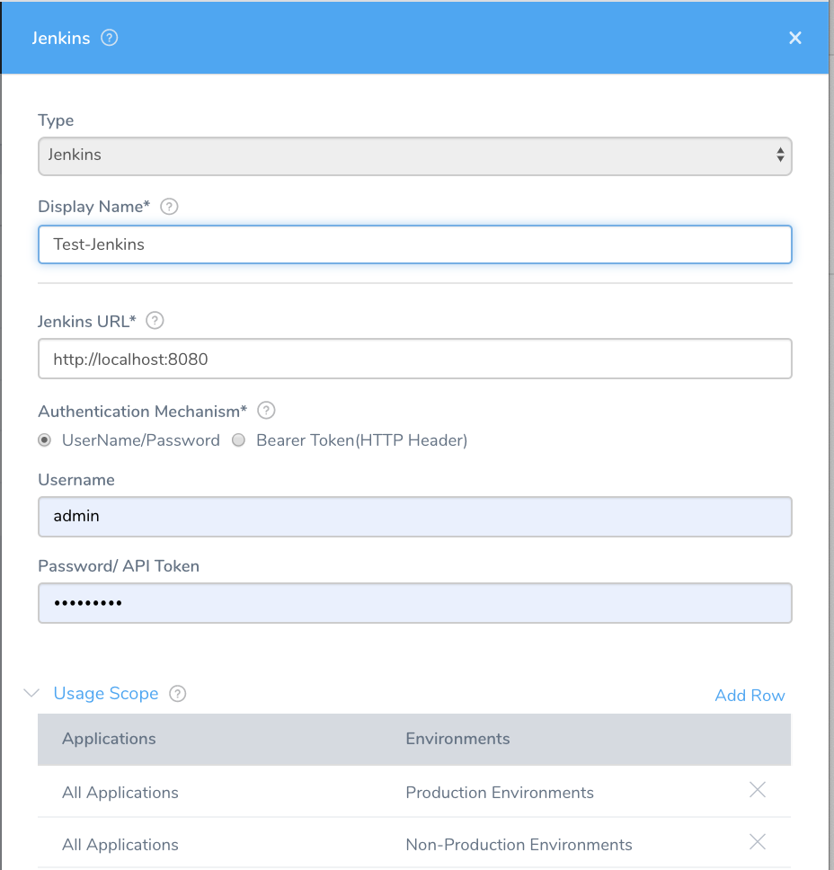

We will create a Harness SSH deployment. This is also called a [Traditional deployment](https://docs.harness.io/article/6pwni5f9el-traditional-deployments-overview).

The same approach works for other types of deployments, such as Kubernetes, ECS, Helm, Pivotal, and so on. For deployments, you would use the corresponding Cloud Providers, and Service and Workflow deployment types.Next, we create the Harness Application with the following components:

* **Cloud Provider** — We are using the Physical Data Center Cloud Provider to connect to the VMs where we will deploy our artifact and run our tests:

  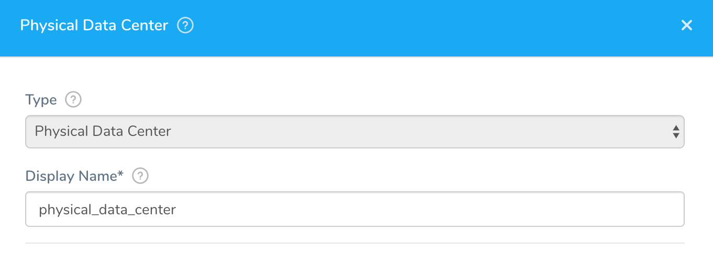
	
* **Service** — We are using a Service with a **Secure Shell (SSH)** deployment type and a **Java Archive (JAR)** artifact. It simply copies the artifact to the target hosts, and installs and runs the application.

  
	
* **Environment** and **Infrastructure Provisioner** — Our Environment has an Infrastructure Provisioner that uses the Physical Data Center Cloud Provider to connect to the target VMs.

  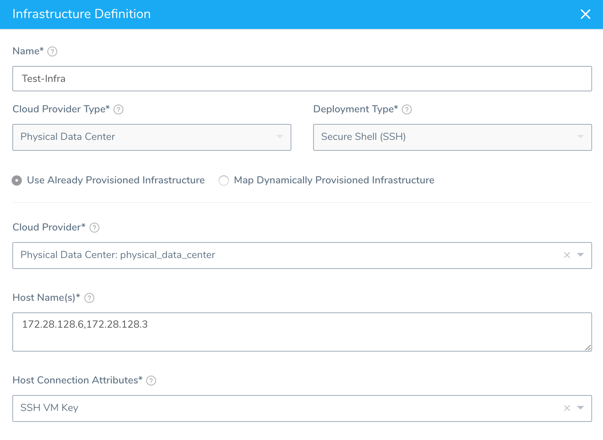
	
* **Workflow** — We created a Workflow to deploy our artifact and run our tests. The Workflow deployment type is Basic. A Basic Workflow simply selects the nodes defined in the Infrastructure Provisioner and deploys the Service.

  

1. Click **Select Nodes**. In Select Nodes, you select the target hosts where the application will be deployed.

   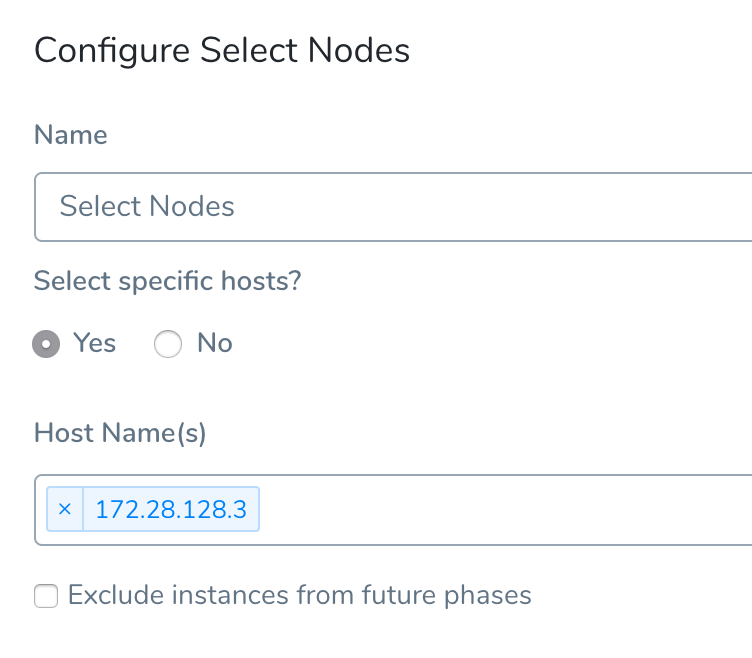

The **Host Name(s)** IP address is one of the hosts you identified in the Infrastructure Definition **Host Name(s)** setting.

Typically, you would have many Environments such as Dev, QA, UAT, SIT. Each Environment contains an Infrastructure Definitions that can be used for any Service.

This Environment configuration enables the same Workflow to run using different Environments without any additional effort.

**Use Infrastructure Definitions for Testing** — Another Environment setup variation is to use two Infrastructure Definitions per Environment. For example, a QA-API Infrastructure Definition to deploy the micro-service, and a QA-Test Infrastructure Definition to run the test client. Using a Harness Pipeline, you could run two different Workflows in sequence to deploy the Service on all the hosts configured in QA-API and run the tests on all hosts configured in QA-Test.In the example in this topic, we are using a simple Workflow that deploys and runs the test on the same test host.

1. In step **3. Deploy Service**, add a Jenkins step.
2. To configure the Jenkins step with the Jenkins job for your test, select the Jenkins Artifact Server you added in **Jenkins Server**.
3. In **Job Name**, select the name of the job for your tests. Harness populates the **Job Parameters** automatically.
   
	 
	 
4. Add values for the job parameters Harness automatically populates.

You can use Harness variable expressions for values. For example, Service or Workflow variables. Users can assign values when the Workflow is deployed. See [Variables and Expressions in Harness](https://docs.harness.io/article/9dvxcegm90-variables).

Let's look at the Workflow execution.

As you can see, the test client is run on the selected test host using the Jenkins pipeline.


The result of the Jenkins execution is displayed in **Details**. The pipeline output is also displayed in **Console Output**. 

The Job Status is displayed as **SUCCESS**. Verify the status using Jenkins blue ocean UI and check the Test Results.


Using Jenkins in Workflows allows you to leverage your existing Jenkins infrastructure as part of deployment. You can now run tests and take advantage of Jenkins' distributed testing using nodes/agents (shared test infrastructure resources).

### Use Case 2: Use Third Party Testing Tools

Various testing tools perform functional, load, and stress tests as part of a release. Most of the tests are automated, but some tests can be performed manually.

Let's look at Workflow using the [newman CLI for Postman](https://github.com/postmanlabs/newman) to run automated tests.

Usually, the test client hosts are already installed with the required tools, but in this section we will demonstrate how to use a Docker image to allow any test client hosts to run these tests. The test client hosts must be running Docker.

Let's look at a Basic **Secure Shell (SSH)** Workflow that uses the same Service and Infrastructure Definition we used in the previous section.

1. In the Workflow, in step **3. Deploy Service**, add a Shell Script step.

The Shell Script step will run the Postman collection to execute the tests. Here is the snippet of the postman collection script:


postman collection script

```
cat <<_EOF_ > /tmp/getting-started.json  

{  

  "info": {  

    "_postman_id": "ddf9e653-87d9-4d6c-8b45-fa5772929169",  

    "name": "getting-started",  

    "schema": "https://schema.getpostman.com/json/collection/v2.1.0/collection.json"  

  },  

  "item": [  

    {  

      "name": "quarkus-test",  

      "item": [  

        {  

          "name": "quarkus-loadtest",  

          "request": {  

            "method": "GET",  

            "header": [],  

            "url": {  

              "raw": "http://172.28.128.3:8080/hello/greeting/1234",  

              "protocol": "http",  

              "host": [  

                "172.28.128.3"  

              ],  

              "port": "8080",  

              "path": [  

                "hello",  

                "greeting",  

                "1234"  

              ]  

            }  

          },  

          "response": []  

        }  

      ],  

      "protocolProfileBehavior": {}  

    },  

    {  

      "name": "postman-echo.com/get",  

      "request": {  

        "method": "GET",  

        "header": [],  

        "url": {  

          "raw": "http://172.28.128.3:8080/hello",  

          "protocol": "http",  

          "host": [  

            "172.28.128.3"  

          ],  

          "port": "8080",  

          "path": [  

            "hello"  

          ]  

        },  

        "description": "Initial"  

      },  

      "response": []  

    }  

  ],  

  "protocolProfileBehavior": {}  

}  

_EOF_  

docker run -v /tmp:/tmp -t postman/newman:alpine run /tmp/getting-started.json


```

You can see the command to run the collection at the bottom:


```
docker run -v /tmp:/tmp -t postman/newman:alpine run /tmp/getting-started.json
```
When the Workflow is executed, the console output displays the results of the newman CLI.

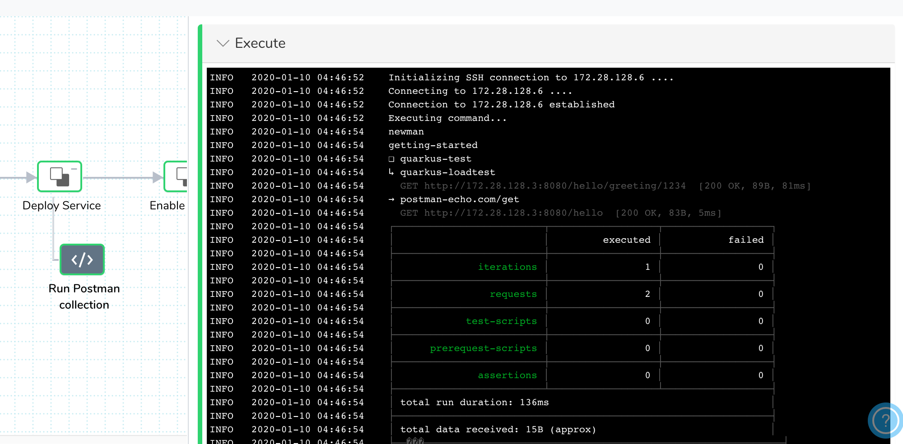

You can use the same method to run other third party automated testing tools *that can be packaged as a Docker image*, such as jmeter.

#### Test Execution Host Options

In some cases, the third party tool or home grown testing framework is installed and configured on a specific host instead of packaged as a Docker image.

In these cases, the Shell Script step can be run on the designated host. For example, you could have a designated test host that runs load testing, and another for performance testing.

Here's how the Shell Script step we used is set up:

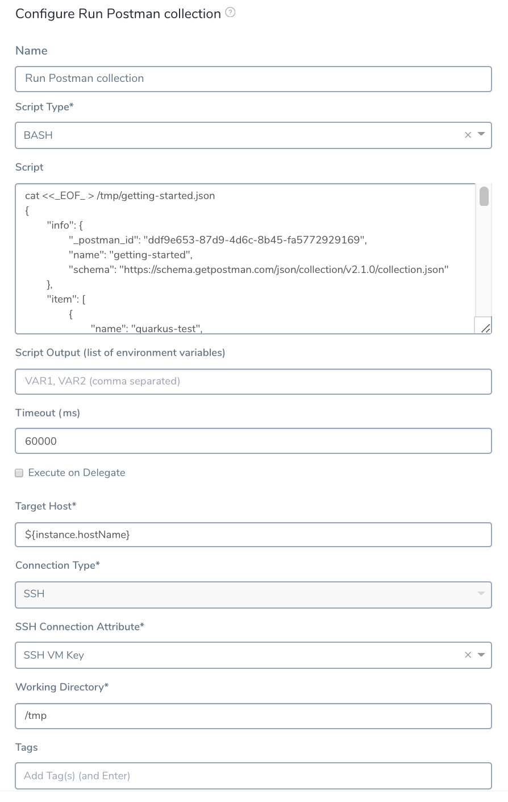

You have the following options of where to run the Shell Script step:

* Run on one or more hosts as defined by the **Select Nodes** step of the Workflow.  
This could be all the hosts configured Infrastructure Definition, a percentage such as 50%, or a count, such as 2 nodes. Here is an example using 50%:

  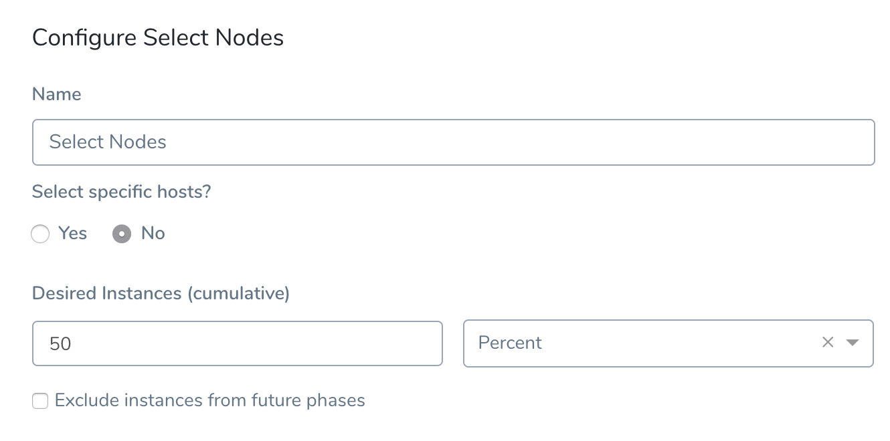
	
* Run the tests on any Delegate or a specific Delegate using Delegate **Tags**.

  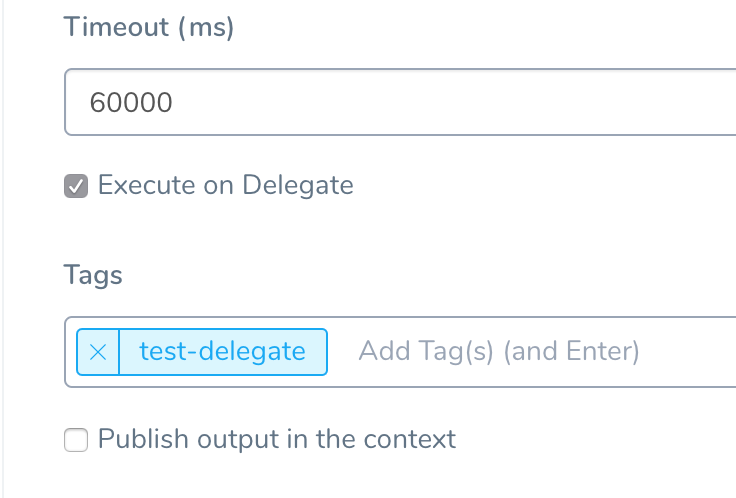
	
* Run the tests on a specific test node using the **Target Host** option and the built-in Harness `${instance.hostName}` expression. See [Variables and Expressions in Harness](https://docs.harness.io/article/9dvxcegm90-variables).

  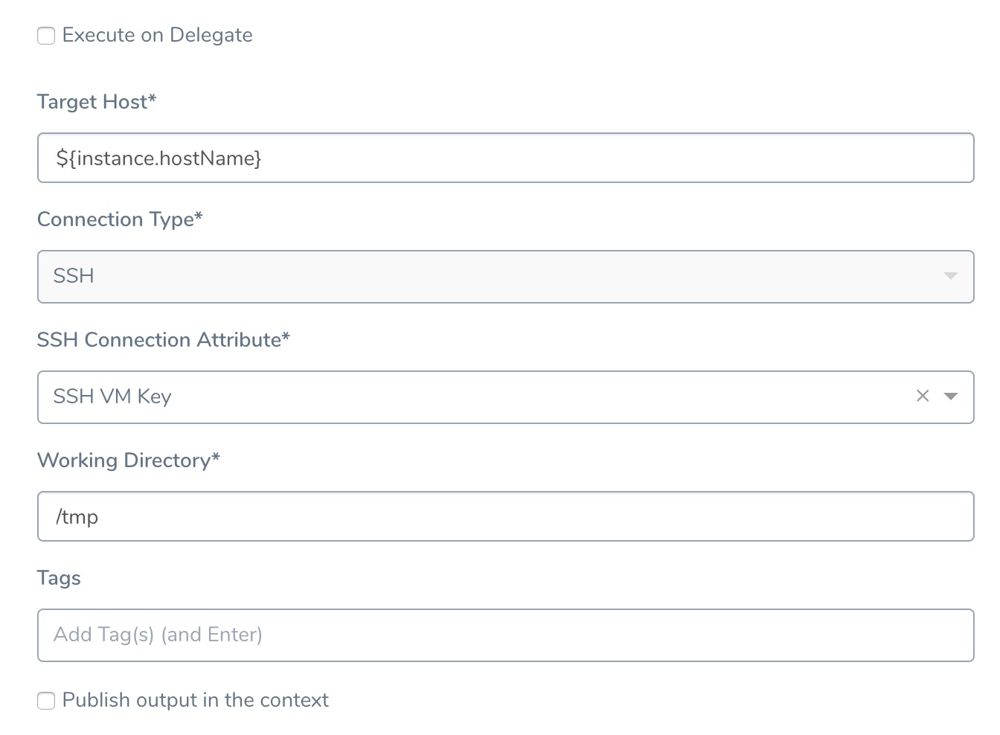

When selecting the target nodes to run a Docker-based test, ensure the nodes are pre-configured with the Docker installation.**Integrate Manual Testing** — To integrate manual testing in your Harness Pipeline, you simply add an Approval stage in the Pipeline. The Approval stage notifies the test team to execute tests. The team can approve or reject the release based on the test results. For more information about Approvals, see [Approvals](../approvals/approvals.md).

### Use Case 3: Run HTTP Tests using HTTP Step

A new application can pass system tests, load tests, and so on, but these tests are not executed on the production deployment, typically.

You still need a way to perform basic smoke or sanity tests before routing production traffic to the new version of the application. 

Harness HTTP Workflow step allows you to perform basic smoke or sanity tests without any dependency on third party tools or having test code in the production environment.

To demonstrate, create a Basic Workflow using the same Service and Infrastructure Definition we've been using so far.

1. In the Workflow, in step **3. Deploy Service**, add a [HTTP command](using-the-http-command.md).
2. Configure the HTTP step to invoke a REST endpoint using GET and assert/verify the response:

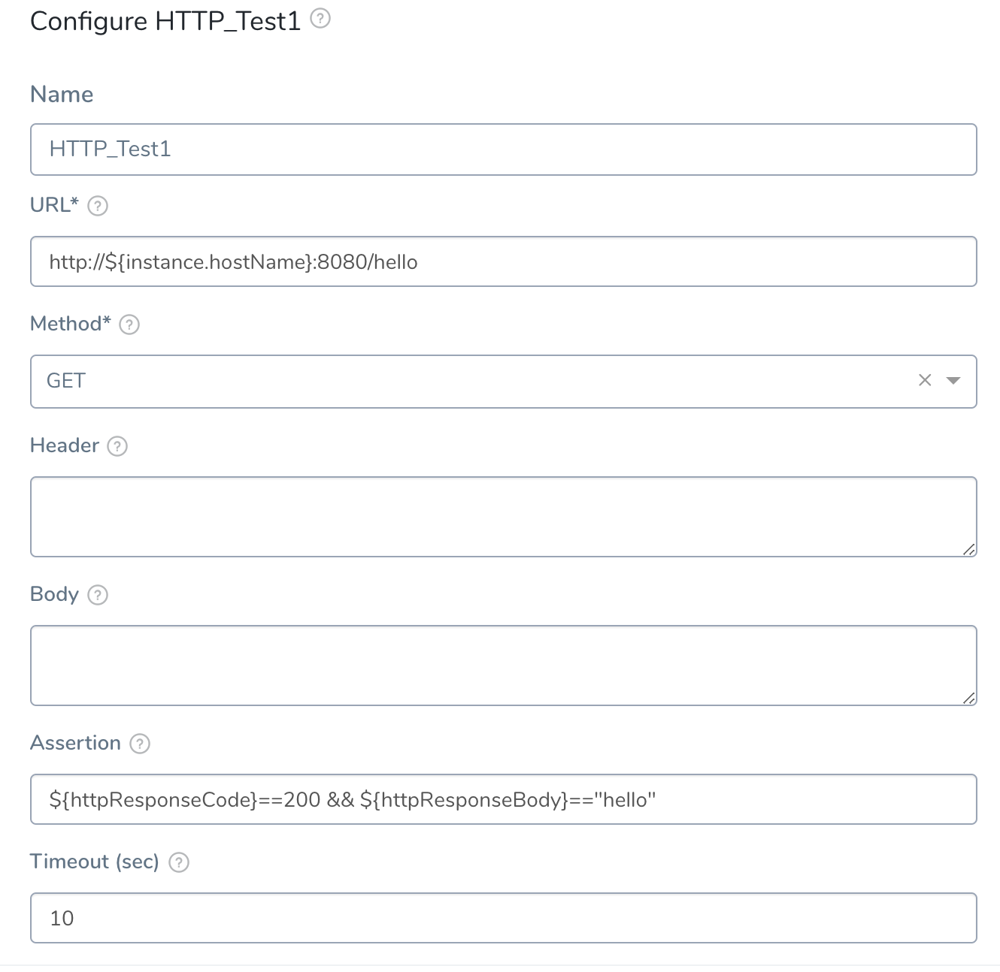

The benefit of this simple test in clear when there is a production deployment failure.

If failure occurs, the Harness Workflow will rollback to the previous successful deployment automatically and immediately.

You can also run multiple HTTP steps in parallel by selecting the **Execute steps in Parallel** option.

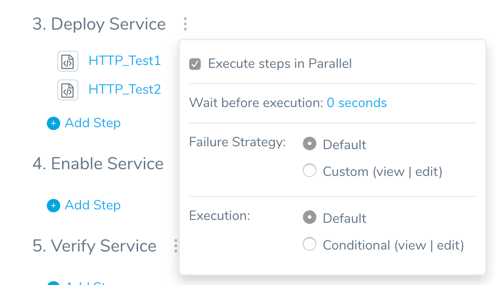

Let's look at the Workflow deployment to see the details of the test:

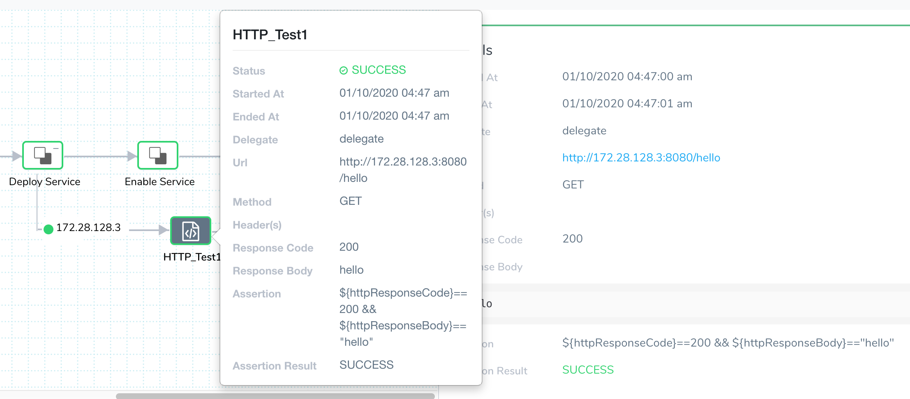

### Use Case 4: Run Docker-based Tests

This use case is a variation of [Use Case 2: Use Third Party Testing Tools](#use_case_2_use_third_party_testing_tools).

In this case, a Docker image containing the tests is pushed to a Docker registry or artifactory server from a CI tool such as Jenkins. This Docker image is then used to run tests as a container in a Kubernetes cluster or using Docker CLI on a test node.

For this example, the Docker image was built using an Apache Maven base image. The Maven project with test sources and the pom.xml was copied into the image.

We use two Build Workflows in this Pipeline, each with a separate Service: one Workflow to deploy the application and the second to run the Docker-based test.

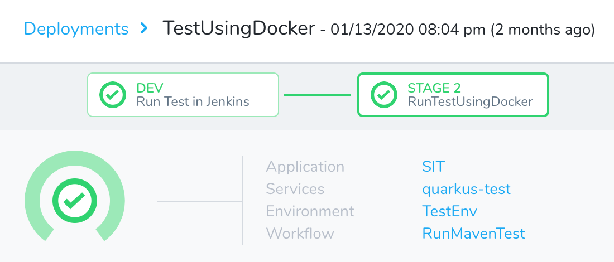

The Harness Service used by the test Workflow is set up with the Docker test image and a Harness Exec command that uses the Docker CLI.

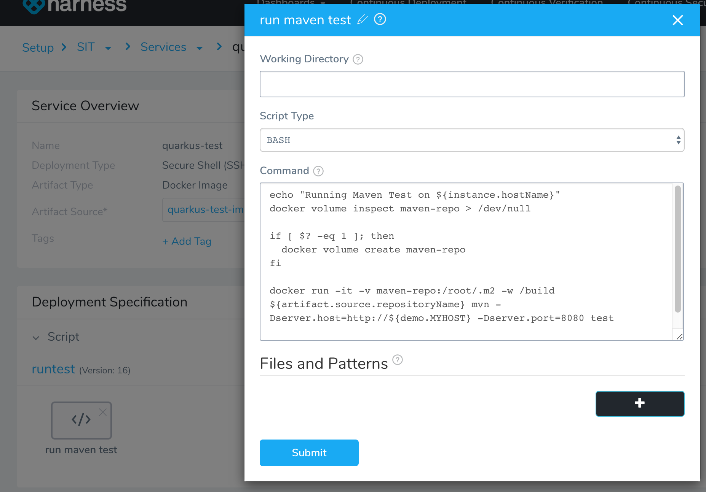

The **run maven test** Exec command contains the Docker CLI to invoke the tests.


```
echo "Running Maven Test on ${instance.hostName}"  
docker volume inspect maven-repo > /dev/null  
  
if [ $? -eq 1 ]; then  
  docker volume create maven-repo  
fi  
  
docker run -it -v maven-repo:/root/.m2 -w /build ${artifact.source.repositoryName} mvn -Dserver.host=http://${demo.MYHOST} -Dserver.port=8080 test
```
This enables any test host in the infrastructure to execute the tests if its running Docker and has connectivity to the node hosting the REST API.

The Artifact Source in the Service is named **quarkus-test-image**. It uses a Harness Docker Hub Artifact Server connection to a Docker registry.

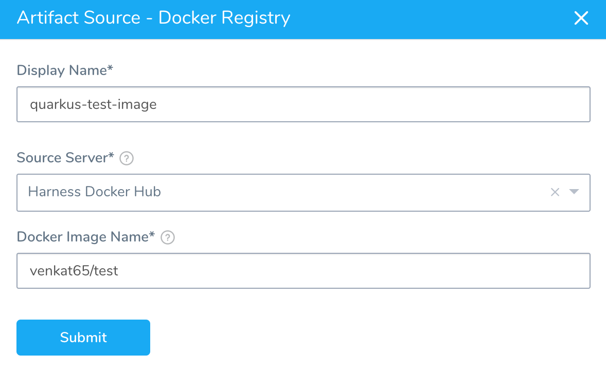

The Docker image is referenced in the **run maven test** Exec command script as `${artifact.source.repositoryName}`.

You can modify the script to specify image tag/version using `${artifact.buildNo}`. See [Variables and Expressions in Harness](https://docs.harness.io/article/9dvxcegm90-variables).

We is using the latest image (the default). The REST API endpoint listed in the script is at `${demo.MYHOST}`. This is a variable published from a Shell Script step in the previous Workflow in the Pipeline. `${demo.MYHOST}` is the hostname of the instance where the application was deployed.

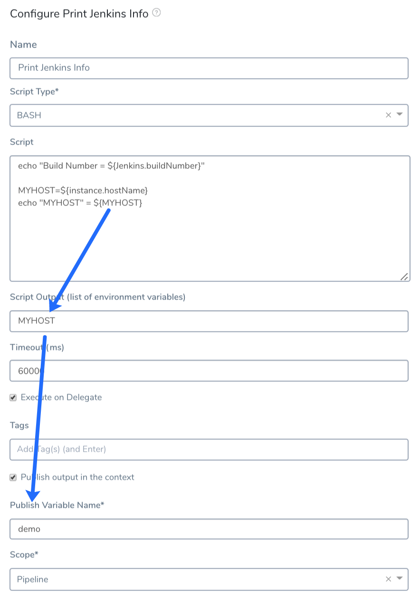

Also, note the use of Docker volume `maven-repo`. This allows subsequent runs of the test to use the Maven repository cached in the test node.

Let's look at the Workflow execution.

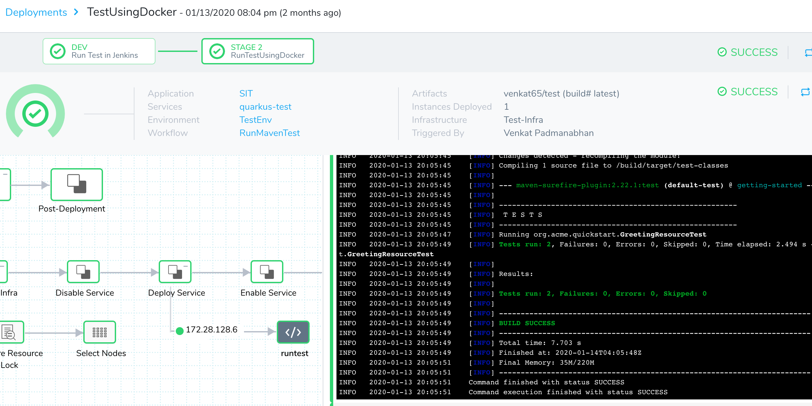

You can see the output of the Exec command in the Details:


```
Running Maven Test on 172.28.128.6  
[INFO] Scanning for projects...  
[INFO]   
[INFO] ------------------------------------------------------------------------  
[INFO] Building getting-started 1.0-SNAPSHOT  
[INFO] ------------------------------------------------------------------------  
[INFO]   
[INFO] --- maven-resources-plugin:2.6:resources (default-resources) @ getting-started ---  
[INFO] Using 'UTF-8' encoding to copy filtered resources.  
[INFO] Copying 2 resources  
[INFO]   
[INFO] --- maven-compiler-plugin:3.8.1:compile (default-compile) @ getting-started ---  
[INFO] Changes detected - recompiling the module!  
[INFO] Compiling 2 source files to /build/target/classes  
[INFO]   
[INFO] --- maven-resources-plugin:2.6:testResources (default-testResources) @ getting-started ---  
[INFO] Using 'UTF-8' encoding to copy filtered resources.  
[INFO] skip non existing resourceDirectory /build/src/test/resources  
[INFO]   
[INFO] --- maven-compiler-plugin:3.8.1:testCompile (default-testCompile) @ getting-started ---  
[INFO] Changes detected - recompiling the module!  
[INFO] Compiling 1 source file to /build/target/test-classes  
[INFO]   
[INFO] --- maven-surefire-plugin:2.22.1:test (default-test) @ getting-started ---  
[INFO]   
[INFO] -------------------------------------------------------  
[INFO]  T E S T S  
[INFO] -------------------------------------------------------  
[INFO] Running org.acme.quickstart.GreetingResourceTest  
[INFO] Tests run: 2, Failures: 0, Errors: 0, Skipped: 0, Time elapsed: 2.494 s - in org.acme.quickstart.GreetingResourceTest  
[INFO]   
[INFO] Results:  
[INFO]   
[INFO] Tests run: 2, Failures: 0, Errors: 0, Skipped: 0
```
With Docker-based tests, provisioning and setting up shared test infrastructure is very simple: you simply need to set up Docker.

The Docker image includes the necessary tools and libraries, so any test node can execute the tests whether it is implemented as Java, Node.js, or other tools.

Since the tests are run as Docker containers, environment variables or files from previous runs do not persist between runs, resulting in repeatable tests.

### Review

This article showed you some of the benefits of integrated testing in Harness:

* Harness supports the reuse of existing scripts.
* Harness supports tools that integrate tests with the deployment release process.
* You can reuse and leverage existing testing tools and scripts, but also simplify your custom scripts to reduce maintenance.
* DevOps teams can track execution and view the results from the single Harness UI.

### Next Steps

* [Artifact Build and Deploy Pipelines Overview](https://docs.harness.io/article/0tphhkfqx8-artifact-build-and-deploy-pipelines-overview)

