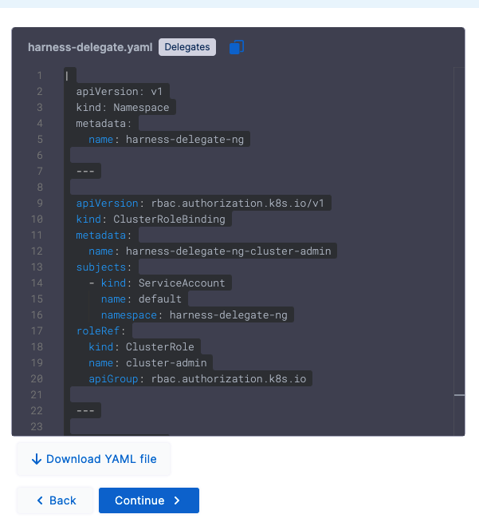

You can use delegate setup files to run startup scripts on delegate host, container, or pod during the installation process.

You can also add script after the Delegate is installed, and then simply restart the Delegate.

This topic describes how to set up the Delegate config files for running scripts.

### Limitations

* Editing or deleting scripts can prevent the automatic removal of binaries that were installed earlier. This means you must restart or remove them from the pod or VM.
* You cannot use Harness secrets in scripts. Connectivity to Harness is established only after the script is run and the delegate is registered with Harness.

### Application installation by delegate type

* **Legacy Delegate**. Use `INIT_SCRIPT` to install applications. The Delegate Profiles feature is deprecated.
* **Harness Delegate**. You can use `INIT_SCRIPT` or add initialization to the delegate image.

### Review: What can I run In a script?

Harness supports the use of the commands that are supported on the host, container or pod that runs the delegate. Linux shell commands are most common. If `kubectl`, Helm, or Docker is running on the host/container/pod where you install the Delegate, you have access to those commands. The Kubernetes and Docker Delegates include Helm.

The Harness Delegate base image is built on Ubuntu 18.04 or later. This means the delegate script supports default Ubuntu packages.

Harness Delegate installation packages include `TAR` and `cURL`. You can use `cURL` and `TAR` in your delegate scripts without installing these tools. For example, the following script runs without additional dependencies:


```
microdnf install -y unzip  
apt-get install -y python  
curl "https://s3.amazonaws.com/aws-cli/awscli-bundle.zip" -o "awscli-bundle.zip"  
unzip awscli-bundle.zip  
./awscli-bundle/install -b ~/bin/aws
```
#### When do scripts run?

Delegate scripts are applied under the following conditions:

* **New Delegate** - If you add a Delegate script when you create the Delegate, the commands are executed before the Delegate is started.
* **Running Delegate** - If you apply a Delegate script to a running Delegate, either by applying it as a new script or by switching the Delegate’s current script, the script commands are executed when the Delegate is restarted, but before the Delegate comes up.

### Step 1: Download the delegate config file

When you install a Delegate, you are prompted to download its config file. For Kubernetes and Docker Delegates, this is a YAML file.


Download the file and open it in a text editor.

### Step 2: Add a script to the delegate INIT\_SCRIPT environment variable

In the Delegate config file, locate the `INIT_SCRIPT` environment variable.

For example, here it is in the Kubernetes Delegate harness-delegate.yaml file:


```
...  
apiVersion: apps/v1  
kind: StatefulSet  
...  
spec:  
...  
    spec:  
    ...  
        env:  
        ...  
        - name: INIT_SCRIPT  
          value: |-  
            echo install wget  
            apt-get install wget  
            echo wget installed  
...
```
In `value`, enter your script. For a list of common scripts, see [Common Delegate Initialization Scripts](../delegate-reference/common-delegate-profile-scripts.md).

A multiline script must follow the YAML spec for [literal scalar style](https://yaml.org/spec/1.2-old/spec.html#id2795688).The script should not be in quotes.For the Docker Delegate, Harness uses a Docker compose file, so you add your script like this:


```
...  
      - |  
        INIT_SCRIPT=  
        echo Init Script Example  
        echo Done!!  
...
```
A Docker Compose file doesn't use the exact same YAML formatting as Kubernetes manifests and so the script formatting is slightly different.

### Step 3: Install the delegate

Follow the remaining Delegate installation steps.

See:

* [Install a Kubernetes Delegate](install-a-kubernetes-delegate.md)
* [Install a Docker Delegate](../delegate-install-docker/install-a-docker-delegate.md)

### Step 4: Verify the script

Check the Delegate pod/host/container to see if the script ran correctly.

For example, here is a simple hello world script in a Docker Delegate:


```
...  
      - |  
        INIT_SCRIPT=  
        echo hello world!  
...
```
The Docker Delegate file is a Docker compose file so it uses YAML formatting different from Kubernetes manifest YAML.Once the Delegate in installed, run `docker ps` to get the container Id, and then run `docker logs <contain Id>`.

In the logs, you will see that your script has run before the Delegate is installed.

The script is run between `Starting initialization script for Delegate` and `Completed executing initialization script`:


```
% docker logs 9d405639948f  
Watcher not running  
Delegate not running  
  
Starting initialization script for Delegate  
hello world!  
Completed executing initialization script  
Checking Watcher latest version...  
The current version 1.0.72500 is not the same as the expected remote version 1.0.72702  
Downloading Watcher 1.0.72702 ...  
######################################################################## 100.0%  
Checking Delegate latest version...  
Downloading Delegate  ...  
#=#=#                                                                           
Watcher started  

```
### See also

* [Automate Delegate Installation](automate-delegate-installation.md)

