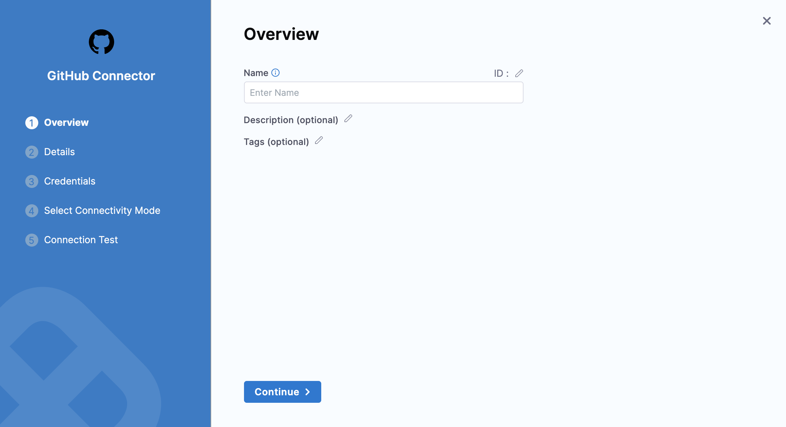
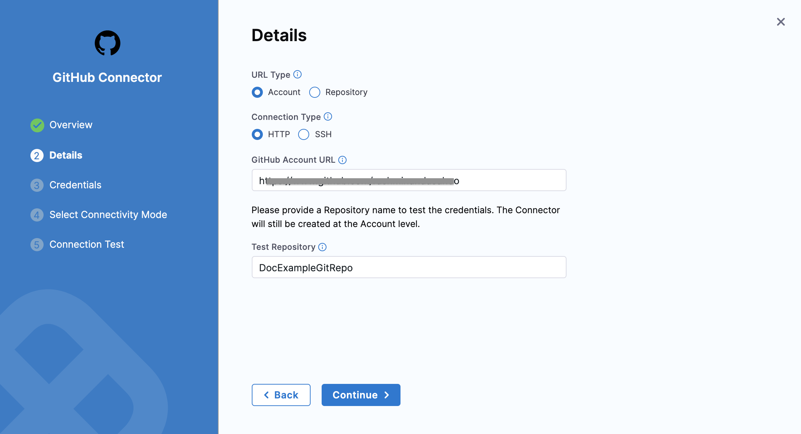
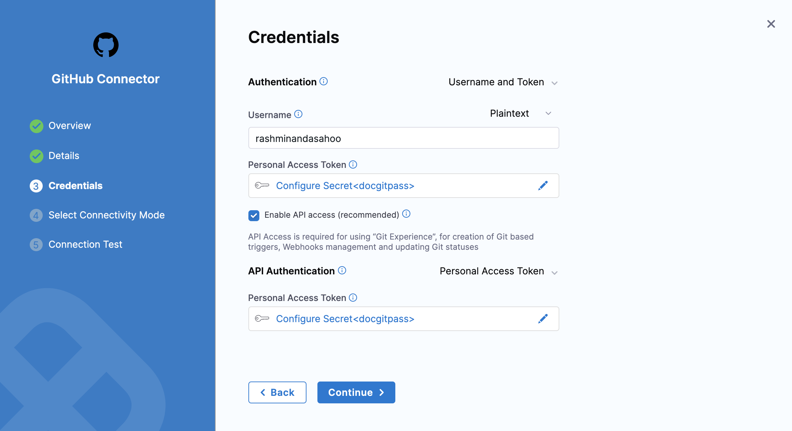
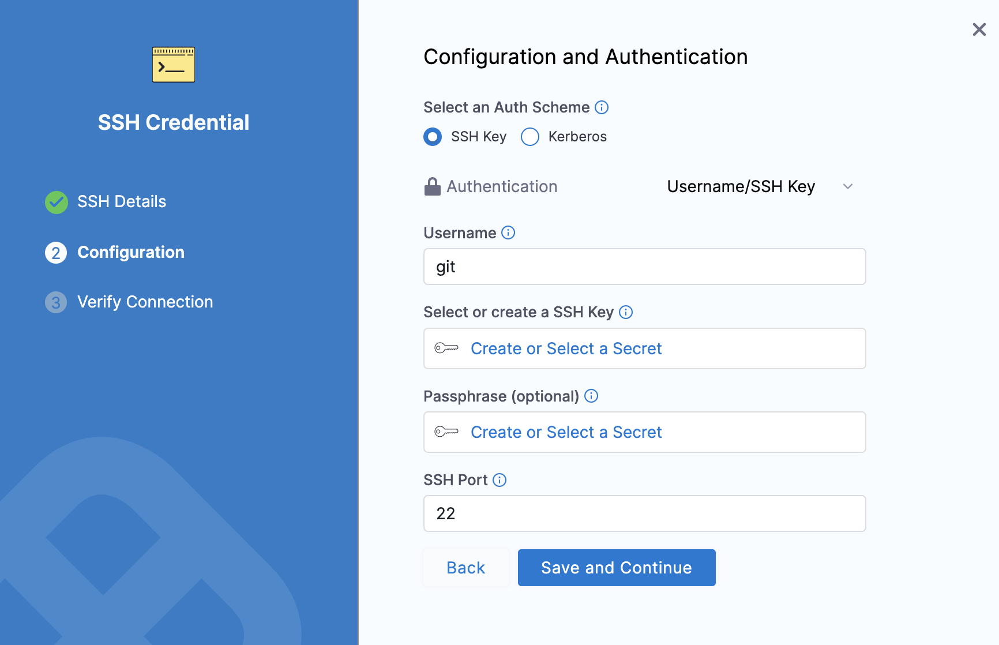
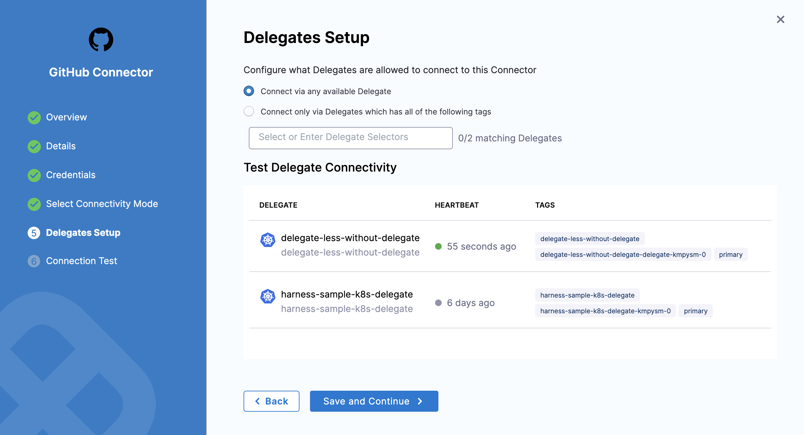

Harness Code Repository Connectors connect your Harness account with your Git platform. Connectors are used to pull important files, such as Helm charts, Kubernetes manifests, and Terraform scripts.

### Before you begin

* [Learn Harness' Key Concepts](https://docs.harness.io/article/hv2758ro4e-learn-harness-key-concepts)

### Step 1: Add a GitHub Code Repo Connector

This topic assumes you have a Harness Project set up. If not, see [Create Organizations and Projects](../1_Organizations-and-Projects/2-create-an-organization.md).

You can add a Connector from any module in your Project in Project setup, or in your Organization, or Account Resources.

This topic shows you how to add a ServiceNow Connector to your Project.

In **Project Setup**, click **Connectors**.

Click **New Connector**, and then click **GitHub**. The GitHub Connector settings appear.

Enter a name for this Connector.

You can choose to update the **ID** or let it be the same as your ServiceNow Connector's name. For more information, see [Entity Identifier Reference](../20_References/entity-identifier-reference.md).

Enter **Description** and **Tags** for your Connector.

Click **Continue**.

For details on each setting, see [GitHub Connector Settings Reference](ref-source-repo-provider/git-hub-connector-settings-reference.md).

### Step 2: Details

Select **Account** or **Repository** in **URL Type**.

Select **Connection Type** as **HTTP** or **SSH**.

Enter your **GitHub Account URL**.

In **Test Repository**, enter your repository name to test the connection.

Click **Continue**.

For SSH, ensure that the key is not OpenSSH, but rather PEM format. To generate an SSHv2 key, use: `ssh-keygen -t ecdsa -b 256 -m PEM` The `-m PEM` ensure that the key is PEM. Next, follow the prompts to create the PEM key. For more information, see the [ssh-keygen man page](https://linux.die.net/man/1/ssh-keygen) and [Connecting to GitHub with SSH](https://help.github.com/en/github/authenticating-to-github/connecting-to-github-with-ssh).

### Step 3: Credentials

In **Credentials,** enter your **Username**.

You can either create a new [Encrypted Text](../6_Security/2-add-use-text-secrets.md) or use an existing one.

In **Personal Access Token**, either create a new [Encrypted Text](../6_Security/2-add-use-text-secrets.md) or use an existing one that has your Git token. Harness requires the token for API access. Generate the token in your account on the Git provider and add it to Harness as a Secret.

To use a personal access token with a GitHub organization that uses SAML single sign-on (SSO), you must first authorize the token. See [Authorizing a personal access token for use with SAML single sign-on](https://docs.github.com/en/enterprise-cloud@latest/authentication/authenticating-with-saml-single-sign-on/authorizing-a-personal-access-token-for-use-with-saml-single-sign-on) from GitHub.* The GitHub user account used to create the Personal Access Token must have admin permissions on the repo.
* GitHub doesn't provide a way of scoping a PAT for read-only access to repos. You must select the following permissions:

If you selected **SSH** as the connection protocol, you must add the **SSH Key** to use with the connection as a [Harness Encrypted Text secret](../6_Security/2-add-use-text-secrets.md). For detailed steps to create an SSH Key, see [Add new SSH Key](https://docs.github.com/en/authentication/connecting-to-github-with-ssh/adding-a-new-ssh-key-to-your-github-account) from GitHub.

Make sure the **Username** for your **SSH Credential** is `git` for the Test Connection to be successful.  

Harness also supports [GitHub deploy keys](https://docs.github.com/en/developers/overview/managing-deploy-keys#deploy-keys). Deploy keys grant access to a single repo. Using a deploy key ensures that the Connector only works with the specific repo you selected in **URL Type**.

#### Enable API access

This option is required for using Git-based triggers, Webhooks management, and updating Git statuses.

You can use the same token you used in **Personal Access Token**.

Click **Continue**.

### Step 4: Connect to the Provider

In **Select Connectivity Mode**, you have two options:

* **Connect Through Harness Platform:** Harness SaaS will connect to your Git repo whenever it needs to pull code or a file or sync.
* **Connect Through a Harness Delegate:** Harness will make all connections using the Harness Delegate. This option is used for Harness Self-Managed Enterprise Edition Overview often, but it is also used for Harness SaaS. See [Harness Self-Managed Enterprise Edition Overview](https://docs.harness.io/article/tb4e039h8x-harness-on-premise-overview).

**Secrets:** if you select **Connect Through Harness Platform**, the Harness Manager exchanges a key pair with the Secrets Manager configured in Harness using an encrypted connection. Next, the Harness Manager uses the encrypted key and the encrypted secret and then discards them. The keys never leave the Harness Manager. Secrets are always encrypted in transit, in memory, and in the Harness database.If you select **Connect Through** **Harness Platform**, click **Save and Continue**.

If you select **Connect Through a Harness Delegate**, click **Continue** and then select/add the Delegate you want to use in **Delegates Setup**. See [Delegate Installation Overview](https://docs.harness.io/article/re8kk0ex4k-delegate-installation-overview).

Click **Save and Continue**.

Harness tests the connection. Click **Finish** once the verification is successful.

The GitHub connector is listed in Connectors.

