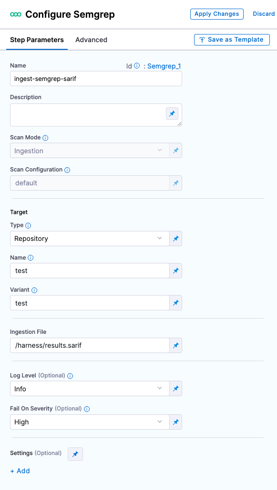

You can scan repositories using [Semgrep](https://www.semgrep.com), an open-source static analysis engine for detecting dependency vulnerabilities and other issues in your code repositories. 


## Before you begin

<!-- 
### Docker-in-Docker requirements

```mdx-code-block
import StoDinDRequirements from '/docs/security-testing-orchestration/sto-techref-category/shared/dind-bg-step.md';
```

<StoDinDRequirements />

-->

### Root access requirements

```mdx-code-block
import StoRootRequirements from '/docs/security-testing-orchestration/sto-techref-category/shared/root-access-requirements.md';
```

<StoRootRequirements />


## Semgrep step configuration

The recommended workflow is to add a Semgrep step to a Security Tests or CI Build stage and then configure it as described below. 

```mdx-code-block
import StoScannerStepNotes from './shared/step_palette/_sto-palette-notes.md';
```

<StoScannerStepNotes />

<details>
    <summary>Semgrep scanner template</summary>

 

</details>

### Scan


<a name="scan-mode"></a>

#### Scan Mode

```mdx-code-block
import StoSettingScanMode from './shared/step_palette/_sto-ref-ui-scan-mode.md';
import StoSettingScanModeIngest from './shared/step_palette/_sto-ref-ui-scan-mode-02-ingestonly.md';
```

<StoSettingScanMode />
<StoSettingScanModeIngest />

#### Scan Configuration

```mdx-code-block
import StoSettingProductConfigName from './shared/step_palette/_sto-ref-ui-product-config-name.md';
```

<StoSettingProductConfigName />


### Target

<a name="target-type"></a>

#### Type

```mdx-code-block
import StoSettingScanType from './shared/step_palette/_sto-ref-ui-scan-type.md';
import StoSettingScanTypeRepo     from './shared/step_palette/_sto-ref-ui-scan-type-00-repo.md';

```
<a name="scan-type"></a>
<StoSettingScanType />
<StoSettingScanTypeRepo />


#### Name 

```mdx-code-block
import StoSettingProductID from './shared/step_palette/_sto-ref-ui-prod-id.md';
```

<StoSettingProductID />

<a name="target-variant"></a>

#### Variant

```mdx-code-block
import StoSettingTargetVariant from './shared/step_palette/_sto-ref-ui-target-variant.md';
```

<StoSettingTargetVariant  />

<!-- 
#### Workspace (_repository_)

```mdx-code-block
import StoSettingTargetWorkspace from './shared/step_palette/_sto-ref-ui-target-workspace.md';
```

<StoSettingTargetWorkspace  />

-->

### Ingestion File

```mdx-code-block
import StoSettingIngestionFile from './shared/step_palette/_sto-ref-ui-ingestion-file.md';
```

<StoSettingIngestionFile  /> 

<!--   Log Level, CLI flags, and Fail on Severity ------------------------------------------------------------------------------------------------- -->


<a name="log-level"></a>

### Log Level

```mdx-code-block
import StoSettingLogLevel from './shared/step_palette/_sto-ref-ui-log-level.md';
```

<StoSettingLogLevel />


### Fail on Severity

```mdx-code-block
import StoSettingFailOnSeverity from './shared/step_palette/_sto-ref-ui-fail-on-severity.md';
```
<StoSettingFailOnSeverity />


### Additional Configuration

In the **Additional Configuration** settings, you can use the following options:

* [Privileged](/docs/continuous-integration/use-ci/manage-dependencies/background-step-settings#privileged)
* [Image Pull Policy](/docs/continuous-integration/use-ci/manage-dependencies/background-step-settings#image-pull-policy)
* [Run as User](/docs/continuous-integration/use-ci/manage-dependencies/background-step-settings#run-as-user)
* [Set Container Resources](/docs/continuous-integration/use-ci/manage-dependencies/background-step-settings#set-container-resources)


### Advanced settings

In the **Advanced** settings, you can use the following options:

* [Conditional Execution](/docs/platform/pipelines/w_pipeline-steps-reference/step-skip-condition-settings/)
* [Failure Strategy](/docs/platform/pipelines/w_pipeline-steps-reference/step-failure-strategy-settings/)
* [Looping Strategy](/docs/platform/pipelines/looping-strategies-matrix-repeat-and-parallelism/)
* [Policy Enforcement](/docs/platform/Governance/Policy-as-code/harness-governance-overview)

## YAML pipeline example

The following pipeline example illustrates an ingestion workflow. It consists of two steps:

* A Run step that uses a [Semgrep container](https://hub.docker.com/r/returntocorp/semgrep) to scan the codebase defined for the pipeline and then publish the results to a SARIF data file.
* A Semgrep step that ingests the SARIF data.


```yaml
pipeline:
  projectIdentifier: STO
  orgIdentifier: default
  tags: {}
  stages:
    - stage:
        name: semgrep-ingest
        identifier: semgrepingest
        type: CI
        spec:
          cloneCodebase: true
          execution:
            steps:
              - step:
                  type: Run
                  name: Run_1
                  identifier: Run_1
                  spec:
                    shell: Sh
                    command: semgrep --sarif --config auto -o /harness/results.sarif /harness
                    envVariables:
                      SEMGREP_APP_TOKEN: <+secrets.getValue("semgrepkey")>
                    connectorRef: account.harnessImage
                    image: returntocorp/semgrep
                    resources:
                      limits:
                        memory: 4096M
              - step:
                  type: Semgrep
                  name: Semgrep_1
                  identifier: Semgrep_1
                  spec:
                    mode: ingestion
                    config: default
                    target:
                      name: test
                      type: repository
                      variant: test
                    advanced:
                      log:
                        level: info
                    ingestion:
                      file: /harness/results.sarif
          infrastructure:
            type: KubernetesDirect
            spec:
              connectorRef: mydelegate
              namespace: harness-delegate-ng
              automountServiceAccountToken: true
              nodeSelector: {}
              os: Linux
  identifier: smpsemgrep
  name: smp-semgrep
  properties:
    ci:
      codebase:
        connectorRef: mygitrepodvpwa
        build: <+input>

```
