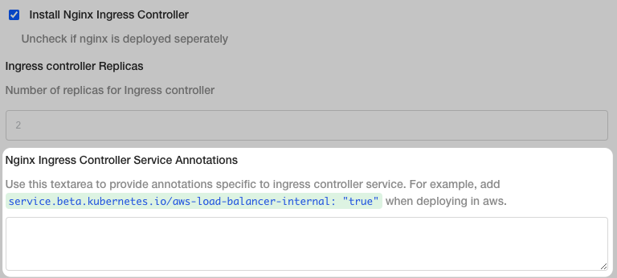

You can customize the behavior of the Nginx ingress controller with annotations. This topic explains how to use the KOTS admin tool to configure the ingress controller with annotations.

### Step 1: Open Advanced Configurations

In the KOTS admin tool, click **Config**.

Click **Advanced Configurations**.

Click **Advanced Configurations**.

Scroll down to **Nginx Ingress Controller Service Annotations**.

### Step 2: Annotate the ingress controller

Locate the **Nginx Ingress Controller Service Annotations** section**.** Type your annotations into the text area. For more information, see [NGINX Ingress Controller Annotations](https://kubernetes.github.io/ingress-nginx/user-guide/nginx-configuration/annotations/) and [Ingress Controllers](https://kubernetes.io/docs/concepts/services-networking/ingress-controllers/) in Kubernetes.io.

Click **Save Config**.

### Step 3: Deploy

Click **Version History** in the top nav.

Click **Deploy** to update the ingress controller.

